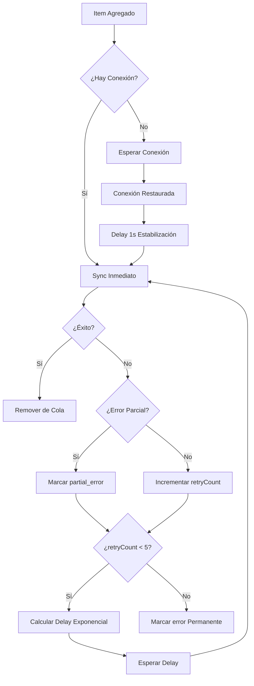

# Regla 6 — Sincronización Automática

## 📋 Definición

Sistema de sincronización automática con detección de conectividad, reintentos exponenciales y manejo de errores parciales para garantizar la integridad de datos en entornos con conectividad intermitente.

## 🎯 Características Principales

### 1. **Detección de Conectividad**
- Monitoreo continuo del estado de red usando `@react-native-community/netinfo`
- Detección de conexión a internet (no solo WiFi/datos activados)
- Estados: `online` / `offline`

### 2. **Sincronización Automática**
- ✅ Sync automático cuando vuelve la conexión
- ✅ Sync automático al agregar nuevo item (si hay conexión)
- ✅ Delay de estabilización de 1 segundo tras restaurar conexión
- ✅ Límite de concurrencia: 3 items simultáneos

### 3. **Reintentos Exponenciales**
- **Estrategia**: Exponential backoff con multiplicador 2x
- **Delay base**: 1 segundo
- **Delay máximo**: 60 segundos (1 minuto)
- **Máximo de reintentos**: 5 intentos
- **Fórmula**: `delay = min(baseDelay * (2 ^ retryCount), maxDelay)`

| Reintento | Delay |
|-----------|-------|
| 1 | 1s |
| 2 | 2s |
| 3 | 4s |
| 4 | 8s |
| 5 | 16s |

### 4. **Errores Parciales**
- Detección de errores en documentos individuales dentro de un lote
- Estado `partial_error` para items parcialmente sincronizados
- Permite reintentos selectivos de solo los documentos que fallaron
- Indicador visual diferenciado (⚠️ vs ❌)

## 🏗️ Arquitectura

### Estados de Sincronización

```typescript
type SyncStatus = 
  | "pending"        // Esperando sincronización
  | "syncing"        // Sincronizando actualmente
  | "error"          // Error completo
  | "partial_error"; // Algunos documentos fallaron
```

### Estructura de Item

```typescript
interface SyncItem {
  id: string;                    // Identificador único
  type: "survey" | "response" | "user"; // Tipo de recurso
  timestamp: number;             // Timestamp de creación
  retryCount: number;            // Intentos realizados
  lastAttempt?: number;          // Timestamp del último intento
  error?: string;                // Mensaje de error
  status: SyncStatus;            // Estado actual
}
```

## 🔄 Flujo de Sincronización



## 🎨 Componente UI: SyncStatusBanner

Banner visual que muestra el estado de sincronización en la app.

### Estados Visuales

| Estado | Color | Ícono | Acción |
|--------|-------|-------|--------|
| **Sin conexión** | Naranja | `cloud-offline` | ❌ No clickeable |
| **Sincronizando** | Azul | `sync` (rotando) | ❌ No clickeable |
| **Error completo** | Rojo | `alert-circle` | ✅ Click para reintentar |
| **Error parcial** | Rojo | `warning` | ✅ Click para reintentar |
| **Pendiente** | Naranja | `cloud-upload` | ✅ Click para sincronizar |

### Uso

```tsx
import { SyncStatusBanner } from "@/components/shared";

function MyScreen() {
  return (
    <View>
      <SyncStatusBanner />
      {/* Resto del contenido */}
    </View>
  );
}
```

## 🔧 Uso del Context

### Agregar Item para Sincronizar

```typescript
import { useSync } from "@/contexts/sync-context";

const { addPendingItem } = useSync();

// Agregar respuesta de encuesta
addPendingItem({
  id: `response_${responseId}`,
  type: "response",
});

// Agregar encuesta
addPendingItem({
  id: `survey_${surveyId}`,
  type: "survey",
});
```

### Monitorear Estado

```typescript
const { 
  pendingCount,    // Total de items pendientes
  errorCount,      // Items con error
  isOnline,        // Estado de conexión
  isSyncing,       // Sincronización en progreso
  pendingByType,   // Contador por tipo
} = useSync();

console.log(`${pendingCount} items pendientes`);
console.log(`${errorCount} items con error`);
console.log(`Online: ${isOnline ? "Sí" : "No"}`);
```

### Sincronizar Manualmente

```typescript
const { syncAll } = useSync();

// Sincronizar todos los items pendientes
await syncAll();
```

### Marcar Error

```typescript
const { markItemError } = useSync();

// Error completo
markItemError("response_123", "Network timeout");

// Error parcial (algunos docs fallaron)
markItemError("response_456", "2 de 5 documentos fallaron", true);
```

## 🚦 Configuración de Reintentos

```typescript
const RETRY_CONFIG = {
  maxRetries: 5,           // Máximo de reintentos
  baseDelay: 1000,         // Delay base en ms
  maxDelay: 60000,         // Delay máximo en ms
  backoffMultiplier: 2,    // Multiplicador exponencial
};
```

### Personalizar Configuración

Para ajustar los reintentos, editar en [contexts/sync-context.tsx](../contexts/sync-context.tsx):

```typescript
// Más agresivo (más reintentos, menos delay)
const RETRY_CONFIG = {
  maxRetries: 10,
  baseDelay: 500,
  maxDelay: 30000,
  backoffMultiplier: 1.5,
};

// Más conservador (menos reintentos, más delay)
const RETRY_CONFIG = {
  maxRetries: 3,
  baseDelay: 2000,
  maxDelay: 120000,
  backoffMultiplier: 3,
};
```

## 🔒 Manejo de Errores Parciales

### ¿Qué es un Error Parcial?

Ocurre cuando:
- Se envían múltiples documentos en un batch
- Algunos documentos se sincronizan exitosamente
- Otros documentos fallan

### Detección

El backend debe indicar error parcial con:

```typescript
// Respuesta del API
{
  success: false,
  code: "PARTIAL_SYNC_ERROR",
  message: "2 de 5 documentos fallaron",
  failedDocs: ["doc1", "doc3"],
  successfulDocs: ["doc2", "doc4", "doc5"]
}
```

### Lógica Frontend

```typescript
try {
  const response = await syncAPI(item);
  return true;
} catch (error: any) {
  const isPartialError = 
    error.message?.includes("partial") || 
    error.code === "PARTIAL_SYNC_ERROR";
  
  markItemError(item.id, error.message, isPartialError);
  return false;
}
```

## 📊 Logs y Debugging

El sistema genera logs detallados:

```
🌐 Network restored - Auto-syncing pending items...
🚀 Starting sync of 3 items...
🔄 Syncing response (response_123), attempt 1
✅ Successfully synced response (response_123)
🔄 Syncing survey (survey_456), attempt 1
❌ Failed to sync survey (survey_456): Network timeout
⏱️  Retry 1/5 for survey_456 in 1000ms
🔄 Syncing survey (survey_456), attempt 2
✅ Successfully synced survey (survey_456)
✅ Sync complete: 3 successful, 0 failed
```

## 🎯 Escenarios de Uso

### Escenario 1: Usuario sin conexión llena encuesta

```
1. Usuario completa encuesta → addPendingItem()
2. Estado: "pending", offline
3. Banner: "Sin conexión - 1 elemento esperando"
4. Usuario activa WiFi/datos
5. Evento de red → Auto-sync activado
6. Delay 1s → syncAll()
7. Item sincronizado → Removido de cola
```

### Escenario 2: Fallo temporal de red

```
1. Item agregado → Sync intento 1
2. Falla: "Network timeout"
3. Estado: "pending", retryCount: 1
4. Delay 1s → Sync intento 2
5. Falla nuevamente
6. Estado: retryCount: 2
7. Delay 2s → Sync intento 3
8. Éxito → Item removido
```

### Escenario 3: Error parcial en batch

```
1. Response con 5 documentos → Sync
2. 3 docs OK, 2 docs fallan
3. Estado: "partial_error"
4. Banner: "⚠️ Error parcial en sincronización"
5. Usuario hace click → Reintenta solo docs fallidos
6. Éxito → Item removido
```

### Escenario 4: Máximo de reintentos alcanzado

```
1. Item agregado → Sync intento 1 → Falla
2. Delay 1s → Intento 2 → Falla
3. Delay 2s → Intento 3 → Falla
4. Delay 4s → Intento 4 → Falla
5. Delay 8s → Intento 5 → Falla
6. Estado: "error" permanente
7. Banner: "❌ Error en sincronización - Toca para reintentar"
8. Usuario puede reintentar manualmente
```

## 🔐 Consideraciones de Seguridad

1. **Validación de datos**: Validar datos antes de agregar a cola
2. **Timeouts**: Implementar timeouts en llamadas API
3. **Tokens**: Manejar tokens expirados durante sync
4. **Concurrencia**: Limitar sincronizaciones paralelas
5. **Integridad**: Verificar integridad de datos post-sync

## 📱 Integración en Pantallas

### En Layout Global

```tsx
// app/_layout.tsx
import { SyncProvider } from "@/contexts/sync-context";
import { SyncStatusBanner } from "@/components/shared";

export default function RootLayout() {
  return (
    <SyncProvider>
      <Stack>
        <SyncStatusBanner />
        {/* Resto de la app */}
      </Stack>
    </SyncProvider>
  );
}
```

### En Pantallas Específicas

```tsx
// app/(brigadista)/my-surveys.tsx
import { useSync } from "@/contexts/sync-context";
import { SyncStatusBanner } from "@/components/shared";

export default function MySurveysScreen() {
  const { addPendingItem } = useSync();

  const handleCompleteSurvey = async (responseData) => {
    // Guardar localmente
    await saveToLocalDB(responseData);
    
    // Agregar a cola de sincronización
    addPendingItem({
      id: `response_${responseData.id}`,
      type: "response",
    });
  };

  return (
    <View>
      <SyncStatusBanner />
      {/* Contenido de la pantalla */}
    </View>
  );
}
```

## ✅ Checklist de Implementación

- [x] Instalar `@react-native-community/netinfo`
- [x] Crear interfaz `SyncItem` con estados extendidos
- [x] Implementar detección de conectividad
- [x] Implementar reintentos exponenciales
- [x] Agregar soporte para errores parciales
- [x] Crear componente `SyncStatusBanner`
- [x] Documentar sistema completo
- [ ] Integrar con API backend
- [ ] Agregar persistencia de cola (AsyncStorage/MMKV)
- [ ] Implementar límite de tamaño de cola
- [ ] Agregar métricas y analytics
- [ ] Pruebas unitarias del sistema de reintentos
- [ ] Pruebas de integración offline/online

## 🚀 Próximos Pasos

1. **Persistencia de Cola**
   - Guardar pendingItems en AsyncStorage o MMKV
   - Restaurar cola al iniciar app
   - Prevenir pérdida de datos en crash

2. **Priorización**
   - Items críticos (respuestas) tienen prioridad
   - Items no críticos (logs) son secundarios
   - Cola con prioridades

3. **Compresión**
   - Comprimir datos antes de enviar
   - Reducir uso de red en conexiones lentas

4. **Analytics**
   - Trackear tasas de éxito/fallo
   - Tiempos de sincronización
   - Patrones de errores

## 🎓 Beneficios

1. ✅ **UX Superior**: Usuario no se preocupa por sincronización
2. ✅ **Confiabilidad**: Datos no se pierden en fallos de red
3. ✅ **Eficiencia**: Reintentos inteligentes evitan sobrecarga
4. ✅ **Transparencia**: Usuario siempre sabe el estado
5. ✅ **Resiliencia**: Sistema robusto ante errores
6. ✅ **Performance**: Sincronización en paralelo con límites
