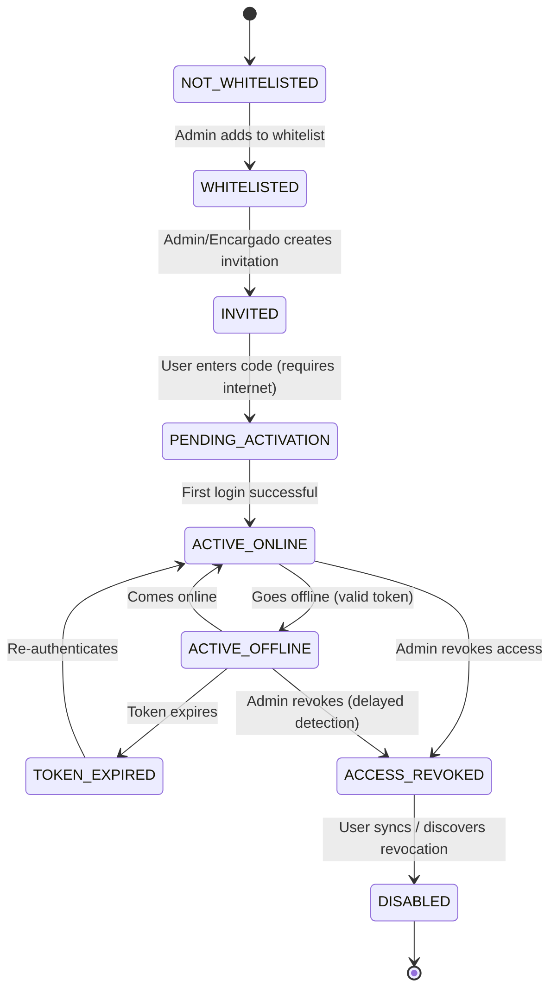
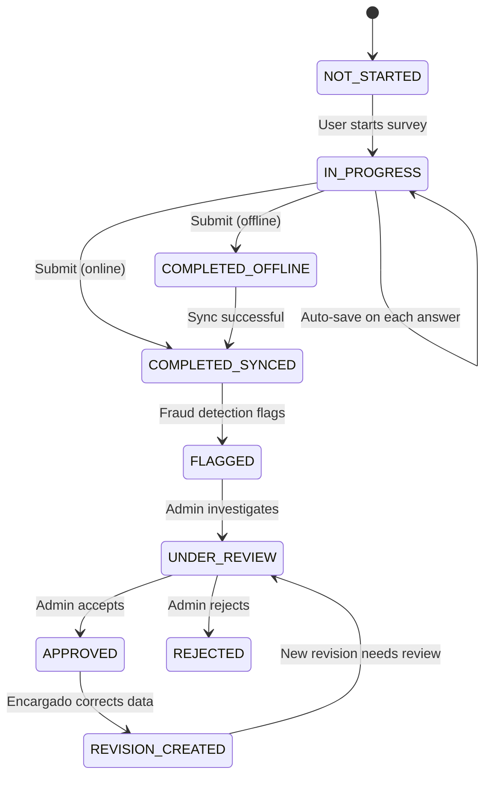
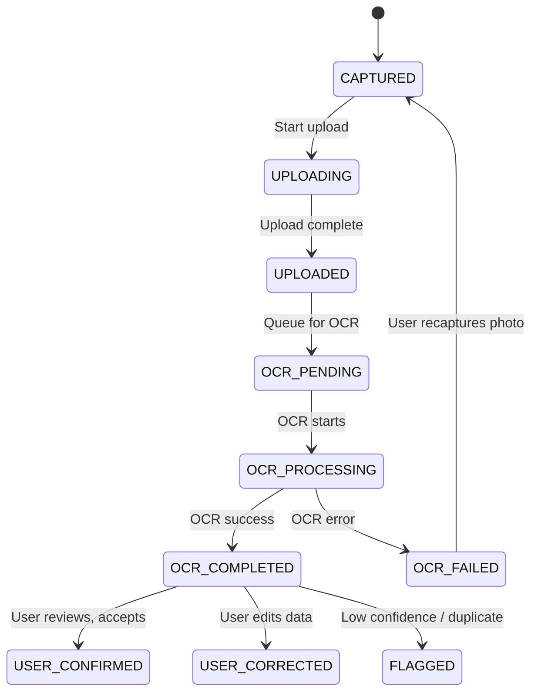

# System Rules Analysis - Brigada Digital

## Complete System Architecture Based on 42 Core Rules

**Generated:** 2026-02-10  
**Version:** 1.0  
**Based on:** 42 foundational system rules

---

## Table of Contents

1. [System States](#system-states)
2. [Permission Boundaries](#permission-boundaries)
3. [Edge Cases & Conflict Scenarios](#edge-cases--conflict-scenarios)
4. [Rule Violation Consequences](#rule-violation-consequences)
5. [State Machines](#state-machines)
6. [Data Flow Diagrams](#data-flow-diagrams)
7. [Implementation Checklist](#implementation-checklist)

---

## System States

### 1. User States (Rules 1-5, 20-24)

```typescript
type UserState =
  | "NOT_WHITELISTED" // User email not in whitelist
  | "WHITELISTED" // Pre-approved but not invited
  | "INVITED" // Invitation sent, code generated
  | "PENDING_ACTIVATION" // Code entered, awaiting first login
  | "ACTIVE_ONLINE" // Can sync with server
  | "ACTIVE_OFFLINE" // Working offline with valid token
  | "TOKEN_EXPIRED" // Offline token expired, needs re-auth
  | "ACCESS_REVOKED" // Admin disabled, pending sync
  | "DISABLED"; // Permanently disabled (soft delete)
```

**State Transitions:**

```
NOT_WHITELISTED → (Admin adds to whitelist) → WHITELISTED
WHITELISTED → (Admin/Encargado creates invitation) → INVITED
INVITED → (User enters code + internet) → PENDING_ACTIVATION
PENDING_ACTIVATION → (First login success) → ACTIVE_ONLINE
ACTIVE_ONLINE → (Goes offline with valid token) → ACTIVE_OFFLINE
ACTIVE_OFFLINE → (Token expires) → TOKEN_EXPIRED
ACTIVE_OFFLINE → (Comes online) → ACTIVE_ONLINE
ACTIVE_* → (Admin revokes access) → ACCESS_REVOKED
ACCESS_REVOKED → (User syncs) → DISABLED
```

**Critical Constraints:**

- **Rule 2 Violation:** If public registration is allowed → spam accounts, security breach
- **Rule 4 Violation:** If activation bypasses code → unauthorized access
- **Rule 5 Violation:** If whitelist check is skipped → anyone can login

---

### 2. Survey Assignment States (Rules 6-11)

```typescript
type SurveyAssignmentState =
  | "UNASSIGNED" // Survey exists, no Encargado assigned
  | "ASSIGNED_ACTIVE" // Encargado has active assignment
  | "ASSIGNED_REVOKED" // Assignment revoked, not yet synced
  | "PENDING_ACCEPTANCE" // Encargado must confirm assignment (optional)
  | "COMPLETED" // All target responses collected
  | "ARCHIVED"; // Survey period ended

type BrigadistaAssignmentState =
  | "NOT_ASSIGNED" // Brigadista not assigned to survey
  | "ASSIGNED" // Active assignment from Encargado
  | "REVOKED_ONLINE" // Revoked while Brigadista online
  | "REVOKED_OFFLINE" // Revoked while Brigadista offline
  | "TARGET_REACHED"; // Met target response count
```

**Assignment Matrix:**

| Scenario                     | Admin    | Encargado                            | Brigadista    | Result                                      |
| ---------------------------- | -------- | ------------------------------------ | ------------- | ------------------------------------------- |
| Assign survey to Encargado   | ✅       | ❌                                   | ❌            | Creates `survey_assignments`                |
| Assign survey to Brigadista  | ✅ (any) | ✅ (only THEIR surveys + THEIR team) | ❌            | Creates `brigadista_assignments`            |
| View survey list             | ALL      | ONLY assigned (`is_active=1`)        | ONLY assigned | Filtered query                              |
| Revoke Encargado assignment  | ✅       | ❌                                   | ❌            | Sets `is_active=0`, cascades to Brigadistas |
| Revoke Brigadista assignment | ✅ (any) | ✅ (only THEIR assignments)          | ❌            | Sets `is_active=0`                          |

**Critical Edge Case - Cascading Revocation:**

```sql
-- Scenario: Admin revokes Encargado's survey assignment
-- What happens to Brigadistas already assigned by that Encargado?

-- Option A: Cascade revocation (chosen design)
UPDATE brigadista_assignments
SET is_active = 0, revoked_at = NOW()
WHERE survey_schema_id = ?
  AND encargado_id = ?;

-- Option B: Orphan assignments (NOT recommended)
-- Leaves Brigadistas with "orphaned" assignments
-- Creates confusion: "Who is responsible now?"
```

**Rule 11 Violation:** If role-only access is used → Encargado sees ALL surveys → breaks assignment model

---

### 3. Survey Response States (Rules 12-16, 20, 39-40)

```typescript
type SurveyResponseState =
  | "NOT_STARTED" // Response ID generated, no answers yet
  | "IN_PROGRESS" // Partially filled, can be edited
  | "COMPLETED_OFFLINE" // Filled offline, pending sync
  | "COMPLETED_SYNCED" // Synced to server
  | "FLAGGED_OUT_OF_WINDOW" // Completed outside survey date range
  | "FLAGGED_DUPLICATE_DOC" // OCR detected duplicate INE
  | "FLAGGED_LOW_CONFIDENCE" // OCR confidence < threshold
  | "UNDER_REVIEW" // Admin reviewing flagged response
  | "APPROVED" // Admin approved despite flags
  | "REJECTED" // Admin rejected (soft delete)
  | "REVISION_CREATED"; // New version created from correction
```

**Immutability Rules (Rule 14-15):**

```typescript
interface SurveyResponse {
  id: string; // Original response UUID
  version: number; // v1, v2, v3...
  parentResponseId?: string; // If this is a revision
  submittedAt: string; // Original submission time
  revisedAt?: string; // Latest revision time
  isLatestVersion: boolean; // Only latest version is "active"
  responsibleEncargadoId: string; // IMMUTABLE (Rule 12-13)
  collectedBy: string; // The Brigadista who filled it
  status: SurveyResponseState;
}

// WRONG: Overwriting original response
async function correctResponse_WRONG(responseId: string, newData: any) {
  await db
    .update(surveyResponses)
    .set({ answers: newData }) // ❌ VIOLATES RULE 14
    .where({ id: responseId });
}

// CORRECT: Creating revision chain
async function correctResponse_CORRECT(responseId: string, newData: any) {
  const original = await getResponse(responseId);

  // Mark original as superseded
  await db
    .update(surveyResponses)
    .set({ isLatestVersion: false })
    .where({ id: responseId });

  // Create new revision
  const revision = await db.insert(surveyResponses).values({
    id: generateUUID(),
    version: original.version + 1,
    parentResponseId: original.id,
    responsibleEncargadoId: original.responsibleEncargadoId, // IMMUTABLE
    collectedBy: original.collectedBy,
    submittedAt: original.submittedAt,
    revisedAt: new Date().toISOString(),
    isLatestVersion: true,
    answers: newData,
    status: "REVISION_CREATED",
  });

  return revision;
}
```

**Rule 13 Violation:** If `responsibleEncargadoId` changes → audit trail breaks, blame shifts illegally

---

### 4. Survey Version States (Rules 17-18)

```typescript
type SurveySchemaState =
  | "DRAFT" // Being designed, not published
  | "ACTIVE" // Published, can be assigned
  | "ARCHIVED" // No longer assignable, past responses intact
  | "DEPRECATED"; // Superseded by newer version

interface SurveySchema {
  id: string; // Unique survey ID
  version: number; // v1, v2, v3...
  schemaHash: string; // SHA256 of schema JSON (detects changes)
  publishedAt?: string; // When v1 was published
  deprecatedAt?: string; // When this version was superseded
  status: SurveySchemaState;
}

// Version compatibility check
function canRespondToSurvey(
  surveySchemaId: string,
  currentVersion: number,
  responseVersion: number,
): boolean {
  // Rule 18: Response references exact version used
  // Even if survey is now v5, v1 responses are valid
  return true; // All versions are valid forever
}
```

**Breaking Change Scenario:**

```json
// Survey v1
{
  "questions": [
    { "id": "q1", "type": "text", "label": "Nombre completo" }
  ]
}

// Survey v2 (WRONG - breaks Rule 17)
{
  "questions": [
    { "id": "q1", "type": "select", "label": "Nombre", "options": [...] }
    //        ^^^^^ Changed type! Now v1 responses can't be parsed
  ]
}

// Survey v2 (CORRECT)
{
  "questions": [
    { "id": "q1", "type": "text", "label": "Nombre completo" }, // Keep q1 unchanged
    { "id": "q1_new", "type": "select", "label": "Nombre (seleccionar)", "options": [...] }
  ]
}
```

**Rule 17 Violation:** If schema changes break old responses → data loss, import errors

---

### 5. Offline Token States (Rules 20-24)

```typescript
type OfflineTokenState =
  | "NONE" // No offline token (must be online)
  | "VALID" // Token valid, can work offline
  | "EXPIRING_SOON" // < 24h remaining, show warning
  | "EXPIRED" // Cannot work offline until re-auth
  | "REVOKED_SERVER"; // Server revoked (user disabled)

interface OfflineToken {
  userId: string;
  token: string; // JWT or encrypted refresh token
  issuedAt: string;
  expiresAt: string; // Rule 23: Must expire
  lastSyncAt: string;
  revokedAt?: string;
  status: OfflineTokenState;
}

// Token validation logic
async function validateOfflineToken(token: string): Promise<TokenValidation> {
  const decoded = decodeToken(token);
  const now = Date.now();

  // Check expiration (Rule 23)
  if (decoded.expiresAt < now) {
    return { valid: false, reason: "TOKEN_EXPIRED" };
  }

  // Check server revocation (Rule 24)
  // This requires periodic sync or local cache of revocation list
  const isRevoked = await checkRevocationList(decoded.userId);
  if (isRevoked) {
    return { valid: false, reason: "ACCESS_REVOKED" };
  }

  return { valid: true, expiresIn: decoded.expiresAt - now };
}
```

**Rule 24 Edge Case - Delayed Revocation:**

```
Timeline:
T0: Brigadista goes offline with valid 7-day token
T1: Admin revokes access (sets user.state = DISABLED)
T2-T6: Brigadista works offline, collects 50 responses
T7: Brigadista comes online, sync attempt fails with 403
    → What happens to 50 responses?

Solution (Rule 24):
- Do NOT delete completed work
- Mark responses as "orphaned" (sync_error = "ACCESS revoked")
- Admin reviews and decides: Accept, Reassign, or Reject
- Audit log records: "50 responses by [user] after revocation"
```

**Rule 22 Violation:** If offline tokens don't expire → indefinite offline access after revocation

---

### 6. Document/OCR States (Rules 25-29, 30-32)

```typescript
type DocumentState =
  | "CAPTURED" // Photo taken, not uploaded
  | "UPLOADING" // Upload in progress
  | "UPLOADED" // Stored in Cloudinary/S3
  | "OCR_PENDING" // Queued for OCR processing
  | "OCR_PROCESSING" // OCR in progress
  | "OCR_COMPLETED" // OCR done, confidence score available
  | "OCR_FAILED" // OCR error (bad image, unsupported format)
  | "USER_CONFIRMED" // User reviewed and confirmed OCR
  | "USER_CORRECTED" // User manually edited OCR results
  | "FLAGGED_DUPLICATE" // Duplicate document detected
  | "FLAGGED_LOW_QUALITY"; // Image too blurry/dark

type FraudFlag =
  | "DUPLICATE_INE" // Same INE captured multiple times
  | "DUPLICATE_SIGNATURE" // Signature hash matches previous
  | "PATTERN_DETECTED" // Same Brigadista, same location, N responses in < M minutes
  | "IMPOSSIBLE_LOCATION" // GPS jump > X km in < Y minutes
  | "OUT_OF_BOUNDS"; // Location outside survey area

interface Document {
  id: string;
  responseId: string;
  type: "ine_front" | "ine_back" | "signature" | "photo" | "proof";

  // Storage (Rule 25-26)
  localUri: string; // file:///... (temporary)
  cloudinaryUrl?: string; // https://res.cloudinary.com/... (permanent)
  sha256: string; // For duplicate detection (Rule 31)

  // OCR (Rule 27-29)
  ocrStatus: DocumentState;
  ocrData?: INEOCRData;
  ocrConfidence?: number; // 0.0-1.0 (Rule 28)
  ocrProcessedAt?: string;
  userConfirmedOcr: boolean; // Rule 29: Never treat OCR as truth

  // Fraud detection (Rule 30-32)
  fraudFlags: FraudFlag[];
  duplicateOfDocumentId?: string;
  flaggedAt?: string;
  flaggedReason?: string;
}

interface INEOCRData {
  nombres: string;
  apellidoPaterno: string;
  apellidoMaterno: string;
  claveElector: string;
  curp: string;
  fechaNacimiento: string;
  sexo: "H" | "M";
  vigencia: string;
  seccion: string;
  confidence: number; // Overall confidence (Rule 28)
  fieldConfidence: {
    // Per-field confidence
    nombres: number;
    apellidoPaterno: number;
    claveElector: number;
    // ...
  };
}
```

**OCR Workflow (Rule 27-29):**

```typescript
// WRONG: Blocking OCR
async function captureINE_WRONG(image: File) {
  const uploaded = await uploadToCloudinary(image);
  const ocrResult = await runOCR(uploaded.url); // ❌ Blocks for 5-30 seconds
  return ocrResult;
}

// CORRECT: Async OCR
async function captureINE_CORRECT(image: File) {
  // 1. Save locally immediately
  const localUri = await saveToFileSystem(image);

  // 2. Create document record with pending OCR
  const doc = await db.insert(attachments).values({
    id: generateUUID(),
    type: "ine_front",
    localUri,
    ocrStatus: "CAPTURED",
    userConfirmedOcr: false,
  });

  // 3. Queue for background processing
  await queueOCRJob(doc.id);

  // 4. Return immediately, OCR runs in background
  return doc;
}

// Background worker
async function processOCRQueue() {
  while (true) {
    const job = await getNextOCRJob();
    if (!job) break;

    try {
      const result = await callOCRAPI(job.imageUrl);

      // Rule 28: Store confidence score
      await db
        .update(attachments)
        .set({
          ocrStatus: "OCR_COMPLETED",
          ocrData: result.data,
          ocrConfidence: result.confidence,
        })
        .where({ id: job.documentId });

      // Rule 32: Flag if low confidence (advisory, not blocking)
      if (result.confidence < 0.7) {
        await flagDocument(job.documentId, "FLAGGED_LOW_QUALITY");
      }
    } catch (error) {
      await db
        .update(attachments)
        .set({ ocrStatus: "OCR_FAILED" })
        .where({ id: job.documentId });
    }
  }
}
```

**Duplicate Detection (Rule 30-32):**

```typescript
// Rule 31: Detect and FLAG, never BLOCK
async function detectDuplicateINE(ineHash: string): Promise<DuplicateCheck> {
  const existing = await db
    .select()
    .from(attachments)
    .where({
      sha256: ineHash,
      type: sql`IN ('ine_front', 'ine_back')`,
    });

  if (existing.length > 0) {
    // Rule 32: Advisory, not punitive
    return {
      isDuplicate: true,
      originalDocumentId: existing[0].id,
      originalResponseId: existing[0].responseId,
      action: "FLAG_AND_CONTINUE", // NOT "BLOCK"
      message: "Esta INE ya fue capturada. ¿Confirmas que es correcta?",
    };
  }

  return { isDuplicate: false };
}

// Fraud pattern detection (Rule 32)
async function detectSuspiciousPatterns(
  brigadistaId: string,
): Promise<FraudFlags> {
  const last30Min = Date.now() - 30 * 60 * 1000;

  const recentResponses = await db
    .select()
    .from(surveyResponses)
    .where({
      collectedBy: brigadistaId,
      startedAt: sql`> ${last30Min}`,
    });

  const flags: FraudFlag[] = [];

  // Pattern 1: Too many responses too fast
  if (recentResponses.length > 20) {
    flags.push("PATTERN_DETECTED");
  }

  // Pattern 2: Same location for all responses
  const uniqueLocations = new Set(
    recentResponses.map((r) => `${r.latitude},${r.longitude}`),
  );
  if (uniqueLocations.size === 1 && recentResponses.length > 10) {
    flags.push("PATTERN_DETECTED");
  }

  // Pattern 3: Impossible GPS jumps
  for (let i = 1; i < recentResponses.length; i++) {
    const prev = recentResponses[i - 1];
    const curr = recentResponses[i];
    const distance = calculateDistance(
      prev.latitude,
      prev.longitude,
      curr.latitude,
      curr.longitude,
    );
    const timeDiff = (curr.startedAt - prev.startedAt) / 1000; // seconds
    const speed = distance / timeDiff; // m/s

    if (speed > 30) {
      // > 108 km/h
      flags.push("IMPOSSIBLE_LOCATION");
    }
  }

  return { flags, advisory: true }; // Rule 32: Advisory only
}
```

**Rule 29 Violation:** If OCR is treated as truth → incorrect data saved without human review

---

### 7. Geolocation States (Rules 33-35)

```typescript
type LocationState =
  | "NOT_CAPTURED" // No location data
  | "REQUESTED" // Permission requested from user
  | "DENIED" // User denied GPS permission
  | "ACQUIRING" // Waiting for GPS fix
  | "ACQUIRED_HIGH" // accuracy < 10m
  | "ACQUIRED_MEDIUM" // accuracy 10-50m
  | "ACQUIRED_LOW" // accuracy > 50m
  | "MOCKED" // Detected mock location (developer mode)
  | "TIMED_OUT"; // GPS timeout (couldn't get fix)

interface LocationData {
  latitude: number;
  longitude: number;
  accuracy: number; // meters (Rule 34)
  altitude?: number;
  speed?: number;
  heading?: number;

  // Rule 34: Source and timestamp
  source: "gps" | "network" | "fused" | "mock";
  capturedAt: string; // ISO timestamp

  // Rule 34: Verification
  isVerified: boolean; // User confirmed location is correct
  isMockLocation: boolean; // Detected mock GPS

  // Rule 35: Address (optional)
  address?: string; // Reverse geocoded address
  geocodedAt?: string;

  state: LocationState;
}

// Location capture with verification (Rule 33-34)
async function captureLocation(): Promise<LocationData> {
  const permission = await requestLocationPermission();
  if (permission === "denied") {
    return { state: "DENIED" };
  }

  try {
    const location = await getCurrentPosition({
      enableHighAccuracy: true,
      timeout: 15000,
      maximumAge: 0,
    });

    // Rule 34: Detect mock locations
    const isMock = await isMockLocation(location);

    return {
      latitude: location.coords.latitude,
      longitude: location.coords.longitude,
      accuracy: location.coords.accuracy,
      source: location.provider,
      capturedAt: new Date(location.timestamp).toISOString(),
      isVerified: false, // User must confirm
      isMockLocation: isMock,
      state: isMock ? "MOCKED" : classifyAccuracy(location.coords.accuracy),
    };
  } catch (error) {
    return { state: "TIMED_OUT" };
  }
}

function classifyAccuracy(accuracy: number): LocationState {
  if (accuracy < 10) return "ACQUIRED_HIGH";
  if (accuracy < 50) return "ACQUIRED_MEDIUM";
  return "ACQUIRED_LOW";
}
```

**Rule 35 Enforcement:**

```typescript
// Mark responses without verified location
interface SurveyResponse {
  // ...
  hasVerifiedLocation: boolean;
  locationQuality: "high" | "medium" | "low" | "none" | "mock";
}

// Admin dashboard shows location quality
function getResponsesWithLocationIssues(): Promise<SurveyResponse[]> {
  return db
    .select()
    .from(surveyResponses)
    .where({
      locationQuality: sql`IN ('low', 'none', 'mock')`,
    });
}
```

**Rule 33 Violation:** If location is just decoration → cannot verify field work, fraud undetectable

---

### 8. Consent States (Rules 36-38)

```typescript
type ConsentState =
  | "NOT_REQUESTED" // Consent not yet requested
  | "DISPLAYED" // Consent text shown to user
  | "ACCEPTED" // User accepted
  | "REJECTED" // User rejected (cannot continue)
  | "EXPIRED"; // Consent version changed, need re-consent

interface ConsentRecord {
  id: string;
  responseId: string;
  consentVersion: number; // Rule 37: Versioned
  consentText: string; // Rule 37: Full text stored
  consentTextHash: string; // Detect changes

  // Rule 37: Timestamp and signature
  displayedAt: string;
  acceptedAt?: string;
  signatureDataUrl?: string; // Base64 image of signature

  // Rule 36: What consent covers
  coversDocuments: boolean; // INE, proof of address
  coversLocation: boolean; // GPS data
  coversDataSharing: boolean; // Share with other agencies

  state: ConsentState;
}

// Consent validation (Rule 36-38)
async function validateConsent(responseId: string): Promise<ConsentValidation> {
  const response = await getResponse(responseId);
  const survey = await getSurvey(response.schemaId);

  // Rule 36: Check if survey requires consent
  if (survey.requiresDocuments || survey.requiresLocation) {
    const consent = await getConsentForResponse(responseId);

    if (!consent || consent.state !== "ACCEPTED") {
      return { valid: false, reason: "CONSENT_REQUIRED" };
    }

    // Rule 38: Check if consent version matches survey
    if (consent.consentVersion !== survey.consentVersion) {
      return { valid: false, reason: "CONSENT_EXPIRED" };
    }
  }

  return { valid: true };
}

// Consent versioning (Rule 38)
const CONSENT_VERSIONS = {
  v1: {
    version: 1,
    effectiveDate: "2025-01-01",
    text: "Autorizo el uso de mis datos...",
    hash: "abc123...",
  },
  v2: {
    version: 2,
    effectiveDate: "2025-06-01",
    text: "Autorizo el uso de mis datos y documentos...", // Added documents
    hash: "def456...",
  },
};

// Rule 38: Retroactive application NOT allowed
async function checkConsentRetroactive(responseId: string): Promise<boolean> {
  const response = await getResponse(responseId);
  const consent = await getConsentForResponse(responseId);

  // Response from v1, consent is v2 → INVALID
  // Must use consent version from response.submittedAt date
  const responseDate = new Date(response.submittedAt);
  const consentAtResponseTime = getConsentVersionAtDate(responseDate);

  return consent.consentVersion === consentAtResponseTime.version;
}
```

**Rule 36 Violation:** If consent is skipped → legal liability, GDPR violations

---

### 9. Admin Visibility States (Rules 42-43)

```typescript
type ResponseVisibility =
  | "PRIVATE" // Only Encargado/Brigadista can see
  | "UNDER_REVIEW" // Admin reviewing, not yet published
  | "PUBLISHED_INTERNAL" // Visible to all system users
  | "PUBLISHED_PUBLIC"; // Visible to external dashboards

interface ResponseVisibilityControl {
  responseId: string;
  visibility: ResponseVisibility;

  // Rule 42: Admin may not see immediately
  publishedAt?: string;
  publishedBy?: string;

  // Reason for visibility state
  reason?: string; // "Pending validation", "Flagged for review", etc.
}

// Permission check (Rule 42)
async function canViewResponse(
  userId: string,
  role: UserRole,
  responseId: string,
): Promise<boolean> {
  const response = await getResponse(responseId);
  const visibility = await getResponseVisibility(responseId);

  // Rule 12: Responsible Encargado can always see
  if (response.responsibleEncargadoId === userId) {
    return true;
  }

  // Rule 12: Brigadista can see own responses
  if (response.collectedBy === userId) {
    return true;
  }

  // Rule 42: Admin visibility depends on state
  if (role === "ADMIN") {
    return visibility.visibility !== "PRIVATE";
  }

  return false;
}
```

---

## Permission Boundaries

### 1. User Creation Permissions (Rules 1-5)

```typescript
// WHO CAN CREATE USERS?
const UserCreationMatrix = {
  ADMIN: {
    canCreateAdmin: true,
    canCreateEncargado: true,
    canCreateBrigadista: true,
    mustBeWhitelisted: true, // Rule 3
    creationMethod: ["invitation", "activation_code"],
  },

  ENCARGADO: {
    canCreateAdmin: false,
    canCreateEncargado: false,
    canCreateBrigadista: true, // Only from their team
    mustBeWhitelisted: true,
    mustBeInTeam: true, // Additional constraint
    creationMethod: ["invitation"],
  },

  BRIGADISTA: {
    canCreateAdmin: false,
    canCreateEncargado: false,
    canCreateBrigadista: false,
    creationMethod: [],
  },
};

// Implementation
async function canCreateUser(
  creatorId: string,
  creatorRole: UserRole,
  targetRole: UserRole,
  targetEmail: string,
): Promise<PermissionCheck> {
  // Rule 2: Only Admin and Encargado can create users
  if (creatorRole === "BRIGADISTA") {
    return { allowed: false, reason: "INSUFFICIENT_PERMISSIONS" };
  }

  // Rule 5: Check whitelist
  const isWhitelisted = await checkWhitelist(targetEmail);
  if (!isWhitelisted) {
    return { allowed: false, reason: "NOT_WHITELISTED" };
  }

  // Encargado-specific rules
  if (creatorRole === "ENCARGADO") {
    if (targetRole !== "BRIGADISTA") {
      return { allowed: false, reason: "CAN_ONLY_CREATE_BRIGADISTAS" };
    }

    // Check if target is in Encargado's team
    const isInTeam = await isInEncargadoTeam(creatorId, targetEmail);
    if (!isInTeam) {
      return { allowed: false, reason: "NOT_IN_YOUR_TEAM" };
    }
  }

  return { allowed: true };
}
```

### 2. Survey Access Permissions (Rules 6-11)

```typescript
// WHO CAN ACCESS SURVEYS?
interface SurveyAccessMatrix {
  role: UserRole;
  canView: "ALL" | "ASSIGNED" | "NONE";
  canCreate: boolean;
  canEdit: boolean;
  canDelete: boolean;
  canAssignToEncargado: boolean;
  canAssignToBrigadista: boolean;
}

const SURVEY_ACCESS: Record<UserRole, SurveyAccessMatrix> = {
  ADMIN: {
    role: "ADMIN",
    canView: "ALL",
    canCreate: true,
    canEdit: true,
    canDelete: true,
    canAssignToEncargado: true,
    canAssignToBrigadista: true,
  },

  ENCARGADO: {
    role: "ENCARGADO",
    canView: "ASSIGNED", // Rule 8-9
    canCreate: false,
    canEdit: false,
    canDelete: false,
    canAssignToEncargado: false,
    canAssignToBrigadista: true, // Only THEIR surveys + THEIR team
  },

  BRIGADISTA: {
    role: "BRIGADISTA",
    canView: "ASSIGNED", // Rule 10
    canCreate: false,
    canEdit: false,
    canDelete: false,
    canAssignToEncargado: false,
    canAssignToBrigadista: false,
  },
};

// Rule 11: Access determined by ROLE + ASSIGNMENT
async function canAccessSurvey(
  userId: string,
  role: UserRole,
  surveyId: string,
): Promise<boolean> {
  // Admin: unrestricted
  if (role === "ADMIN") {
    return true;
  }

  // Encargado: check survey_assignments
  if (role === "ENCARGADO") {
    const assignment = await db
      .selectFrom("survey_assignments")
      .where("survey_schema_id", "=", surveyId)
      .where("encargado_id", "=", userId)
      .where("is_active", "=", 1)
      .executeTakeFirst();

    return assignment !== undefined; // Rule 8-9
  }

  // Brigadista: check brigadista_assignments
  if (role === "BRIGADISTA") {
    const assignment = await db
      .selectFrom("brigadista_assignments")
      .where("survey_schema_id", "=", surveyId)
      .where("brigadista_id", "=", userId)
      .where("is_active", "=", 1)
      .executeTakeFirst();

    return assignment !== undefined; // Rule 10
  }

  return false;
}

// Rule 9: Encargado can ONLY manage assigned surveys
async function canAssignSurveyToBrigadista(
  encargadoId: string,
  surveyId: string,
  brigadistaId: string,
): Promise<PermissionCheck> {
  // Check 1: Encargado has survey assignment
  const hasSurvey = await canAccessSurvey(encargadoId, "ENCARGADO", surveyId);
  if (!hasSurvey) {
    return { allowed: false, reason: "SURVEY_NOT_ASSIGNED_TO_YOU" };
  }

  // Check 2: Brigadista is in Encargado's team
  const isInTeam = await db
    .selectFrom("team_memberships")
    .where("encargado_id", "=", encargadoId)
    .where("brigadista_id", "=", brigadistaId)
    .where("is_active", "=", 1)
    .executeTakeFirst();

  if (!isInTeam) {
    return { allowed: false, reason: "BRIGADISTA_NOT_IN_YOUR_TEAM" };
  }

  return { allowed: true };
}
```

### 3. Response Access Permissions (Rules 12-16)

```typescript
// WHO CAN VIEW RESPONSES?
async function canViewResponse(
  userId: string,
  role: UserRole,
  responseId: string,
): Promise<boolean> {
  const response = await getResponse(responseId);

  // Admin: all responses
  if (role === "ADMIN") {
    return true;
  }

  // Rule 12: Responsible Encargado can always see
  if (response.responsibleEncargadoId === userId) {
    return true;
  }

  // Brigadista: only own responses
  if (role === "BRIGADISTA") {
    return response.collectedBy === userId;
  }

  // Encargado: only if they're responsible
  if (role === "ENCARGADO") {
    return response.responsibleEncargadoId === userId;
  }

  return false;
}

// WHO CAN EDIT RESPONSES?
async function canEditResponse(
  userId: string,
  role: UserRole,
  responseId: string,
): Promise<PermissionCheck> {
  const response = await getResponse(responseId);

  // Rule 14: Cannot edit submitted responses, only create revisions
  if (response.status === "COMPLETED_SYNCED") {
    return {
      allowed: false,
      reason: "RESPONSE_IMMUTABLE",
      alternative: "CREATE_REVISION",
    };
  }

  // Only creator can edit in-progress
  if (response.collectedBy === userId && response.status === "IN_PROGRESS") {
    return { allowed: true };
  }

  return { allowed: false, reason: "NOT_YOUR_RESPONSE" };
}

// WHO CAN CREATE REVISIONS?
async function canCreateRevision(
  userId: string,
  role: UserRole,
  responseId: string,
): Promise<boolean> {
  // Rule 15: Admin and responsible Encargado can create revisions
  const response = await getResponse(responseId);

  if (role === "ADMIN") {
    return true;
  }

  if (role === "ENCARGADO" && response.responsibleEncargadoId === userId) {
    return true;
  }

  return false;
}

// Rule 13: Responsible Encargado NEVER changes
async function changeEncargado_FORBIDDEN(
  responseId: string,
  newEncargadoId: string,
) {
  throw new Error("FORBIDDEN: responsibleEncargadoId is immutable (Rule 13)");
}
```

### 4. Offline Permission Boundaries (Rules 20-24)

```typescript
// WHAT CAN BE DONE OFFLINE?
interface OfflineCapabilities {
  canCreateResponse: boolean;
  canEditResponse: boolean;
  canDeleteResponse: boolean;
  canViewSurveys: boolean;
  canSyncData: boolean;
  requiresInternet: string[];
}

const OFFLINE_PERMISSIONS: Record<UserRole, OfflineCapabilities> = {
  ADMIN: {
    canCreateResponse: false, // Admins typically don't fill surveys
    canEditResponse: false,
    canDeleteResponse: false,
    canViewSurveys: true,
    canSyncData: true,
    requiresInternet: [
      "create_user",
      "assign_survey",
      "revoke_access",
      "view_analytics",
    ],
  },

  ENCARGADO: {
    canCreateResponse: true, // Encargados can fill surveys
    canEditResponse: true, // Only in-progress
    canDeleteResponse: false, // Soft delete only
    canViewSurveys: true, // Cached assigned surveys
    canSyncData: true,
    requiresInternet: [
      "assign_survey_to_brigadista", // Needs server validation
      "view_team_analytics",
    ],
  },

  BRIGADISTA: {
    canCreateResponse: true,
    canEditResponse: true,
    canDeleteResponse: false,
    canViewSurveys: true, // Cached assigned surveys
    canSyncData: true,
    requiresInternet: [], // Everything works offline
  },
};

// Rule 22: First activation requires internet
async function activateAccount(code: string): Promise<ActivationResult> {
  if (!navigator.onLine) {
    throw new Error("ACTIVATION_REQUIRES_INTERNET");
  }

  const invitation = await validateInvitationCode(code); // Server call
  const offlineToken = await generateOfflineToken(invitation.userId);

  // Cache user data and assigned surveys for offline use
  await cacheUserData(invitation.userId);

  return { success: true, offlineToken };
}

// Rule 23: Tokens must expire
function generateOfflineToken(userId: string): OfflineToken {
  const now = Date.now();
  const expiresIn = 7 * 24 * 60 * 60 * 1000; // 7 days

  return {
    userId,
    token: generateJWT({ userId, exp: now + expiresIn }),
    issuedAt: new Date(now).toISOString(),
    expiresAt: new Date(now + expiresIn).toISOString(),
    status: "VALID",
  };
}

// Rule 24: Revocation takes effect on next sync
async function syncUserData(userId: string): Promise<SyncResult> {
  const user = await fetchUserFromServer(userId);

  if (user.state === "DISABLED") {
    // Mark local responses as orphaned
    await db
      .update(surveyResponses)
      .set({
        syncError: "Access revoked",
        status: "FLAGGED_REVOKED_USER",
      })
      .where({ collectedBy: userId, status: "COMPLETED_OFFLINE" });

    // Logout user
    await logout();

    return {
      success: false,
      reason: "ACCESS_REVOKED",
      orphanedResponses: await getOrphanedResponseCount(userId),
    };
  }

  return { success: true };
}
```

---

## Edge Cases & Conflict Scenarios

### Edge Case 1: Cascading Revocation

**Scenario:**

```
T0: Admin assigns Survey A to Encargado E1
T1: E1 assigns Survey A to Brigadistas B1, B2, B3
T2: B1, B2, B3 work offline for 5 days, collect 200 responses
T3: Admin revokes E1's assignment to Survey A
T4: B1, B2, B3 come online and sync
```

**Question:** What happens to 200 responses?

**Options:**

**Option A: Cascade Revocation (Strict)**

```typescript
// When E1 loses Survey A, all B1/B2/B3 lose it too
UPDATE brigadista_assignments
SET is_active = 0, revoked_at = NOW()
WHERE encargado_id = 'E1' AND survey_schema_id = 'Survey_A';

// Result: 200 responses become orphaned
// Pros: Clear ownership chain
// Cons: Harsh, loses valid work
```

**Option B: Keep Brigadista Assignments (Lenient)**

```typescript
// B1/B2/B3 keep access even though E1 lost it
// E1 cannot see their responses anymore
// Responses still reference E1 as responsibleEncargadoId

// Pros: No work lost
// Cons: Confusing ownership (E1 responsible but can't see)
```

**Option C: Transfer to New Encargado (Reassignment)**

```typescript
// Admin assigns Survey A to new Encargado E2
// System prompts: "Transfer B1/B2/B3's orphaned assignments to E2?"
// If yes:
UPDATE brigadista_assignments
SET encargado_id = 'E2'
WHERE encargado_id = 'E1' AND survey_schema_id = 'Survey_A';

// responsibleEncargadoId stays E1 (Rule 13 - immutable)
// But new responses go to E2

// Pros: Work continues, clear ownership
// Cons: Complex, requires admin intervention
```

**RECOMMENDED: Hybrid Approach**

```typescript
async function revokeEncargadoSurveyAssignment(
  surveyId: string,
  encargadoId: string,
): Promise<RevocationResult> {
  // 1. Revoke Encargado assignment
  await db
    .update(surveyAssignments)
    .set({ isActive: false, revokedAt: NOW() })
    .where({ surveySchemaId: surveyId, encargadoId });

  // 2. Find affected Brigadistas
  const brigadistas = await db
    .select()
    .from(brigadistaAssignments)
    .where({ surveySchemaId: surveyId, encargadoId, isActive: true });

  if (brigadistas.length === 0) {
    return { orphanedResponses: 0 };
  }

  // 3. Mark assignments as "PENDING_TRANSFER"
  await db
    .update(brigadistaAssignments)
    .set({
      status: "PENDING_TRANSFER",
      notes: `Original Encargado ${encargadoId} lost survey access`,
    })
    .where({ surveySchemaId: surveyId, encargadoId });

  // 4. Count orphaned responses
  const orphaned = await db
    .select()
    .from(surveyResponses)
    .where({
      schemaId: surveyId,
      responsibleEncargadoId: encargadoId,
      status: sql`IN ('IN_PROGRESS', 'COMPLETED_OFFLINE')`,
    });

  // 5. Notify admin
  await notifyAdmin({
    type: "ORPHANED_RESPONSES",
    count: orphaned.length,
    encargadoId,
    surveyId,
    brigadistas: brigadistas.map((b) => b.brigadistaId),
    action: "REQUIRES_REASSIGNMENT",
  });

  return {
    orphanedResponses: orphaned.length,
    affectedBrigadistas: brigadistas.length,
    requiresAdminAction: true,
  };
}
```

---

### Edge Case 2: Survey Version Mismatch

**Scenario:**

```
T0: Survey v1 published, Brigadista B1 syncs
T1: B1 goes offline
T2: Admin publishes Survey v2 (adds new required field)
T3: B1 fills survey offline using v1 schema
T4: B1 comes online and syncs
```

**Question:** Does v1 response pass v2 validation?

**Solution (Rule 17-18):**

```typescript
interface SurveyResponse {
  schemaId: string;
  schemaVersion: number; // Response references EXACT version used
}

async function validateResponse(
  response: SurveyResponse,
): Promise<ValidationResult> {
  const schema = await getSurveySchema(
    response.schemaId,
    response.schemaVersion,
  );

  // ALWAYS validate against the version used, not latest
  return validateAgainstSchema(response.answers, schema);
}

// Server accepts responses for ANY version, forever
async function syncResponse(response: SurveyResponse): Promise<SyncResult> {
  // Do NOT validate against latest version
  const usedSchema = await getSurveySchema(
    response.schemaId,
    response.schemaVersion,
  );

  if (!usedSchema) {
    return { error: "SCHEMA_VERSION_NOT_FOUND" };
  }

  // Validate against used version
  const validation = await validateAgainstSchema(response.answers, usedSchema);

  return { success: validation.isValid };
}
```

---

### Edge Case 3: Duplicate INE Detection

**Scenario:**

```
T0: Brigadista B1 captures INE of person P1 for Survey A
T1: Brigadista B2 captures same INE for Survey B (different survey)
T2: System detects duplicate hash
```

**Question:** Block or allow?

**Solution (Rule 31-32):**

```typescript
// Rule 31: Detect and FLAG, never BLOCK
async function handleDuplicateINE(
  currentResponseId: string,
  ineHash: string,
): Promise<DuplicateAction> {
  const existing = await findDuplicateINE(ineHash);

  if (!existing) {
    return { action: "PROCEED" };
  }

  // Rule 32: Advisory, not punitive
  return {
    action: "FLAG_AND_WARN",
    warning: "Esta INE ya fue capturada anteriormente",
    originalResponse: {
      id: existing.responseId,
      collectedBy: existing.collectedBy,
      surveyId: existing.surveyId,
      capturedAt: existing.capturedAt,
    },
    userPrompt: {
      question: "¿Es correcta esta captura?",
      options: [
        {
          label: "Sí, es la misma persona en diferente encuesta",
          action: "PROCEED_WITH_FLAG",
        },
        {
          label: "Error, voy a recapturar",
          action: "RECAPTURE",
        },
      ],
    },
  };
}

// Store duplicate flag for admin review
async function flagDuplicateDocument(
  responseId: string,
  documentId: string,
  duplicateOfDocumentId: string,
): Promise<void> {
  await db.insert(fraudFlags).values({
    id: generateUUID(),
    responseId,
    documentId,
    flagType: "DUPLICATE_INE",
    duplicateOfDocumentId,
    flaggedAt: NOW(),
    severity: "MEDIUM", // Not HIGH because could be legitimate
    autoResolved: false,
    requiresAdminReview: true,
  });
}
```

---

### Edge Case 4: Offline Work Outside Survey Window

**Scenario:**

```
T0: Survey active window: 2026-01-01 to 2026-01-31
T1: Brigadista syncs on 2026-01-30, goes offline
T2: Brigadista fills survey on 2026-02-05 (offline, outside window)
T3: Brigadista syncs on 2026-02-10
```

**Question:** Accept or reject out-of-window response?

**Solution (Rule 20):**

```typescript
interface Survey {
  activeFrom: string;
  activeUntil: string;
  allowOutOfWindow: boolean; // Policy decision
}

async function validateResponseTiming(
  response: SurveyResponse,
  survey: Survey
): Promise<TimingValidation> {
  const completedAt = new Date(response.completedAt);
  const windowStart = new Date(survey.activeFrom);
  const windowEnd = new Date(survey.activeUntil);

  if (completedAt < windowStart || completedAt > windowEnd) {
    // Rule 20: Allow but flag
    return {
      valid: true, // Don't reject
      flagged: true,
      flagReason: "OUT_OF_WINDOW",
      details: {
        completedAt: completedAt.toISOString(),
        windowStart: windowStart.toISOString(),
        windowEnd: windowEnd.toISOString(),
        daysOutside: calculateDaysOutside(completedAt, windowStart, windowEnd)
      }
    };
  }

  return { valid: true, flagged: false };
}

// Admin dashboard shows out-of-window responses
async function getOutOfWindowResponses(surveyId: string): Promise<Response[]> {
  return db.select()
    .from(surveyResponses)
    .innerJoin(flaggedResponses, eq(surveyResponses.id, flaggedResponses.responseId))
    .where({
      surveyResponses.schemaId: surveyId,
      flaggedResponses.flagType: "OUT_OF_WINDOW"
    });
}
```

---

### Edge Case 5: Consent Version Change Mid-Survey

**Scenario:**

```
T0: Brigadista starts survey, accepts consent v1
T1: Survey in progress (10/20 questions answered)
T2: Legal team updates consent to v2 (adds new clause)
T3: Brigadista finishes survey
```

**Question:** Which consent version applies?

**Solution (Rule 38):**

```typescript
// Rule 38: Consent at START time applies, not at COMPLETION time
interface SurveyResponse {
  consentVersionAtStart: number; // Captured when survey starts
  startedAt: string;
}

async function startSurvey(surveyId: string): Promise<SurveyResponse> {
  const survey = await getSurvey(surveyId);
  const currentConsentVersion = survey.consentVersion;

  // Display consent
  const accepted = await showConsentDialog(currentConsentVersion);

  if (!accepted) {
    throw new Error("CONSENT_REQUIRED");
  }

  // Lock consent version to start time
  return {
    id: generateUUID(),
    schemaId: surveyId,
    consentVersionAtStart: currentConsentVersion, // IMMUTABLE
    startedAt: NOW(),
    status: "IN_PROGRESS",
  };
}

// Validation ignores consent changes after start
async function validateConsent(response: SurveyResponse): Promise<boolean> {
  const consent = await getConsentRecord(response.id);

  // Use consent version from START, not current version
  return consent.consentVersion === response.consentVersionAtStart;
}
```

---

### Edge Case 6: Brigadista in Multiple Teams

**Scenario:**

```
T0: Brigadista B1 is in Encargado E1's team
T1: Admin adds B1 to Encargado E2's team (B1 now in 2 teams)
T2: E1 assigns Survey A to B1
T3: E2 assigns Survey A to B1 (same survey, different Encargado)
```

**Question:** Does B1 have 1 or 2 assignments?

**Solution:**

```typescript
// B1 has 2 independent assignments
await db.insert(brigadistaAssignments).values([
  {
    id: uuid(),
    surveySchemaId: "Survey_A",
    brigadistaId: "B1",
    encargadoId: "E1",
    targetCount: 50,
  },
  {
    id: uuid(),
    surveySchemaId: "Survey_A",
    brigadistaId: "B1",
    encargadoId: "E2",
    targetCount: 30,
  },
]);

// UI shows combined target
async function getBrigadistaDashboard(brigadistaId: string) {
  const assignments = await db
    .select()
    .from(brigadistaAssignments)
    .where({ brigadistaId, isActive: true });

  // Group by survey
  const grouped = groupBy(assignments, "surveySchemaId");

  return Object.entries(grouped).map(([surveyId, assigns]) => ({
    surveyId,
    totalTargetCount: assigns.reduce((sum, a) => sum + a.targetCount, 0),
    encargados: assigns.map((a) => a.encargadoId),
    note:
      assigns.length > 1
        ? `Asignado por ${assigns.length} encargados`
        : undefined,
  }));
}

// Response tracking: Who gets credit?
async function submitResponse(
  brigadistaId: string,
  surveyId: string,
  answers: any,
): Promise<SurveyResponse> {
  // If B1 has 2 assignments, prompt which Encargado context
  const assignments = await getActiveAssignments(brigadistaId, surveyId);

  let encargadoContext: string;

  if (assignments.length > 1) {
    encargadoContext = await promptEncargadoSelection(assignments);
  } else {
    encargadoContext = assignments[0].encargadoId;
  }

  return {
    id: uuid(),
    schemaId: surveyId,
    collectedBy: brigadistaId,
    responsibleEncargadoId: encargadoContext, // Rule 12
    // ...
  };
}
```

---

## Rule Violation Consequences

### Rule 1-5 Violations (Authentication)

| Rule                                          | Violation                  | Consequence                                                        | Example                                                        |
| --------------------------------------------- | -------------------------- | ------------------------------------------------------------------ | -------------------------------------------------------------- |
| **Rule 1:** No public registration            | Allow anyone to sign up    | - Spam accounts<br>- Unauthorized data access<br>- GDPR violations | Hacker creates 1000 fake accounts, downloads all survey data   |
| **Rule 2:** Only Admin/Encargado create users | Brigadistas can invite     | - Loss of hierarchical control<br>- Unvetted users in system       | Brigadista invites friends to farm responses for payment       |
| **Rule 3:** Whitelist required                | Skip whitelist check       | - Anyone with code can activate<br>- Leaked codes = breach         | Activation code shared on social media, 500 unauthorized users |
| **Rule 4:** Code/invite required              | Direct password reset link | - Bypass approval process<br>- Uncontrolled access                 | User guesses email pattern, resets password without invitation |
| **Rule 5:** Whitelist check on login          | Only check on activation   | - Disabled users can still login<br>- Revocation ineffective       | Fired employee still has offline access for 7 days             |

---

### Rule 6-11 Violations (Assignment System)

| Rule                                                   | Violation                                 | Consequence                                                                               | Example                                                                         |
| ------------------------------------------------------ | ----------------------------------------- | ----------------------------------------------------------------------------------------- | ------------------------------------------------------------------------------- |
| **Rule 7:** Encargados NOT responsible for all surveys | Hierarchical access (all surveys visible) | - Data leak between Encargados<br>- Privacy breach<br>- No survey-specific responsibility | Encargado E1 sees responses from E2's political survey                          |
| **Rule 8:** Explicit assignment required               | Encargado auto-sees new surveys           | - Unintended access<br>- Confusion about responsibility                                   | Admin creates sensitive survey, all Encargados see it immediately               |
| **Rule 9:** Encargado only manages assigned surveys    | Can assign any survey                     | - Unauthorized assignments<br>- Responsibility mismatch                                   | Encargado assigns survey they don't own, responses have wrong responsible party |
| **Rule 10:** Brigadista only fills assigned surveys    | Can fill any survey                       | - Loss of access control<br>- Uncontrolled data collection                                | Brigadista fills high-security survey without authorization                     |
| **Rule 11:** Role + Assignment model                   | Role-only access                          | - Entire assignment system breaks<br>- Rule 7-10 unenforceable                            | System becomes hierarchical again (Rule 7 violation)                            |

---

### Rule 12-16 Violations (Responsibility & Audit)

| Rule                                                  | Violation                        | Consequence                                                                     | Example                                                                 |
| ----------------------------------------------------- | -------------------------------- | ------------------------------------------------------------------------------- | ----------------------------------------------------------------------- |
| **Rule 12:** Every response has responsible Encargado | Orphaned responses allowed       | - No accountability<br>- Cannot trace issues<br>- Audit trail broken            | 500 responses with no responsible party after mass revocation           |
| **Rule 13:** Responsible Encargado is immutable       | Allow changing responsible party | - Blame shifting<br>- Fraudulent audit trail<br>- Legal liability unclear       | Encargado transfers bad responses to another Encargado to hide mistakes |
| **Rule 14:** Submitted responses immutable            | Allow editing submitted data     | - Fraud<br>- Evidence tampering<br>- Audit trail destroyed                      | Encargado changes answers after submission to meet quota                |
| **Rule 15:** Corrections create revisions             | Overwrite originals              | - Cannot prove what was originally collected<br>- Legal disputes unresolvable   | Lawsuit: "This data was changed" - no way to prove original state       |
| **Rule 16:** Soft deletes only                        | Hard delete responses            | - Permanent data loss<br>- Cannot investigate fraud<br>- GDPR compliance issues | Accidentally deleted 10,000 responses, no backup, unrecoverable         |

---

### Rule 17-20 Violations (Versioning & Time)

| Rule                                                    | Violation                      | Consequence                                                                             | Example                                                        |
| ------------------------------------------------------- | ------------------------------ | --------------------------------------------------------------------------------------- | -------------------------------------------------------------- |
| **Rule 17:** Version changes don't break past responses | Change question types          | - Import errors<br>- Data parsing fails<br>- Historical data unreadable                 | Survey v2 changes text to select, v1 responses fail validation |
| **Rule 18:** Response references exact version          | Always validate against latest | - Old responses fail validation<br>- Cannot sync offline work                           | Brigadista offline with v1, server now v3, sync fails          |
| **Rule 19:** Surveys have active windows                | No time restrictions           | - Indefinite data collection<br>- No clear campaign boundaries<br>- Budget/quota issues | Survey meant for Jan still accepting responses in June         |
| **Rule 20:** Out-of-window allowed but flagged          | Reject out-of-window           | - Offline work lost<br>- Valid responses deleted                                        | Brigadista in remote area, late sync, 200 responses rejected   |

---

### Rule 21-24 Violations (Offline Rules)

| Rule                                            | Violation                         | Consequence                                                                   | Example                                                                  |
| ----------------------------------------------- | --------------------------------- | ----------------------------------------------------------------------------- | ------------------------------------------------------------------------ |
| **Rule 21:** Activated users work fully offline | Require periodic re-auth          | - Field work interrupted<br>- Responses lost mid-survey<br>- User frustration | Brigadista in mountains, token expires, loses 3 days of work             |
| **Rule 22:** First activation requires internet | Allow offline activation          | - No server validation<br>- Leaked codes = indefinite access                  | Hacker uses leaked code, activates offline, never syncs                  |
| **Rule 23:** Tokens must expire                 | Indefinite offline tokens         | - Cannot revoke access<br>- Fired employees work forever                      | Former employee with 5-year-old token still collecting data              |
| **Rule 24:** Revocation on next sync, keep work | Delete offline work on revocation | - Valid work lost<br>- User disputes<br>- Cannot audit                        | Admin fires user, 500 completed responses deleted, cannot verify quality |

---

### Rule 25-29 Violations (Files & OCR)

| Rule                                     | Violation                | Consequence                                                                          | Example                                                         |
| ---------------------------------------- | ------------------------ | ------------------------------------------------------------------------------------ | --------------------------------------------------------------- |
| **Rule 25:** Documents stored externally | Store in SQLite database | - Database bloat (100+ GB)<br>- Sync failures<br>- Performance collapse              | App crashes with "Database locked", cannot open                 |
| **Rule 26:** DB stores only metadata     | Store full images        | - Same as Rule 25<br>- Privacy risk (DB dumps leak images)                           | Database backup accidentally shared, contains 50,000 INE photos |
| **Rule 27:** OCR is async                | Block UI for OCR         | - 30-second freeze per photo<br>- User thinks app crashed<br>- Survey abandonment    | Brigadista quits app thinking it's broken, incomplete survey    |
| **Rule 28:** OCR has confidence scores   | Trust all OCR results    | - Incorrect data accepted<br>- No quality filter<br>- Bad decisions based on bad OCR | System auto-fills CURP with 40% confidence OCR, wrong identity  |
| **Rule 29:** OCR never absolute truth    | Skip user confirmation   | - Errors propagate<br>- Legal issues (wrong person documented)                       | Person denied benefits because OCR misread their birthdate      |

---

### Rule 30-32 Violations (Fraud Detection)

| Rule                                      | Violation                          | Consequence                                                                            | Example                                                                    |
| ----------------------------------------- | ---------------------------------- | -------------------------------------------------------------------------------------- | -------------------------------------------------------------------------- |
| **Rule 30:** Document ≠ surveyed person   | Assume document owner = respondent | - Identity fraud undetected<br>- Benefit fraud<br>- Legal liability                    | Brigadista uses own INE for 200 fake responses, undetected                 |
| **Rule 31:** Detect and FLAG, never BLOCK | Block duplicate documents          | - False positives block valid work<br>- Legitimate family surveys rejected             | Twin siblings' surveys rejected as "duplicate person"                      |
| **Rule 32:** Fraud detection is advisory  | Auto-reject flagged responses      | - False positives cause data loss<br>- Over-aggressive filtering<br>- User frustration | Same-building residents flagged as "impossible location" because GPS drift |

---

### Rule 33-35 Violations (Geolocation)

| Rule                                                  | Violation              | Consequence                                                                                                | Example                                                             |
| ----------------------------------------------------- | ---------------------- | ---------------------------------------------------------------------------------------------------------- | ------------------------------------------------------------------- |
| **Rule 33:** Location is evidence                     | Make location optional | - Cannot verify field work<br>- Fraud undetectable<br>- Responses from office indistinguishable from field | Brigadista submits 300 surveys from home, claims field work         |
| **Rule 34:** Store accuracy, source, timestamp        | Store only lat/lon     | - Cannot assess quality<br>- Cannot detect mock GPS<br>- Cannot prove timing                               | Lawsuit: "Response was backdated" - no timestamp to prove otherwise |
| **Rule 35:** Flag responses without verified location | Accept all locations   | - Cannot filter bad data<br>- Analytics corrupted by bad GPS                                               | Heatmap shows responses in ocean because GPS glitched               |

---

### Rule 36-38 Violations (Consent)

| Rule                                         | Violation                          | Consequence                                                            | Example                                                             |
| -------------------------------------------- | ---------------------------------- | ---------------------------------------------------------------------- | ------------------------------------------------------------------- |
| **Rule 36:** Explicit consent for documents  | Implicit consent                   | - GDPR violation<br>- Lawsuits<br>- €20M fine                          | EU citizen sues: "I never consented to INE storage"                 |
| **Rule 37:** Consent is versioned and stored | Overwrite consent text             | - Cannot prove what user accepted<br>- Legal disputes unresolvable     | User: "I didn't agree to data sharing" - no proof of what was shown |
| **Rule 38:** No retroactive consent          | Apply new consent to old responses | - Illegal data use<br>- GDPR violation<br>- Invalidates entire dataset | New consent allows selling data, applied to 2-year-old responses    |

---

### Rule 39-41 Violations (UI & UX)

| Rule                                    | Violation                     | Consequence                                                      | Example                                                          |
| --------------------------------------- | ----------------------------- | ---------------------------------------------------------------- | ---------------------------------------------------------------- |
| **Rule 39:** Assume users make mistakes | Strict validation, no undo    | - Survey abandonment<br>- Lost work<br>- User frustration        | Brigadista accidentally submits, cannot undo, 1-hour survey lost |
| **Rule 40:** Favor speed and recovery   | Complex multi-step validation | - Slow workflow<br>- Field work takes 3x longer<br>- Quota unmet | Survey takes 45 min instead of 15 min, daily quota impossible    |
| **Rule 41:** Error states non-punitive  | Show "ERROR: Invalid input"   | - User panic<br>- Blame culture<br>- Resistance to system        | Brigadista scared to use app, avoids certain questions           |

---

### Rule 42-43 Violations (Admin Visibility)

| Rule                                            | Violation                 | Consequence                                                                           | Example                                                         |
| ----------------------------------------------- | ------------------------- | ------------------------------------------------------------------------------------- | --------------------------------------------------------------- |
| **Rule 42:** Admin may not see data immediately | All data instantly public | - No review process<br>- Bad data visible to leadership<br>- Political issues         | Director sees flagged fraud cases before investigation complete |
| **Rule 43:** Visibility states exist            | Binary public/private     | - Cannot stage data release<br>- Cannot hide during QA<br>- All-or-nothing visibility | Must publish 10,000 responses immediately or hide all           |

---

## State Machines

### User Lifecycle State Machine



### Survey Response Lifecycle State Machine



### Document OCR State Machine



---

## Implementation Checklist

### Phase 1: Database & Models ✅ COMPLETED

- [x] Create user states enum (INVITED, PENDING, ACTIVE, DISABLED)
- [x] Create survey_assignments table (Encargado ↔ Survey)
- [x] Create brigadista_assignments table (Brigadista ↔ Survey)
- [x] Create team_memberships table (Encargado ↔ Brigadista)
- [x] Add consentVersionAtStart to survey_responses
- [x] Add responsibleEncargadoId to survey_responses (immutable)
- [x] Add version, parentResponseId, isLatestVersion to survey_responses
- [x] Create fraud_flags table
- [x] Add ocrConfidence, userConfirmedOcr to attachments
- [x] Create offline_tokens table

### Phase 2: Permission Services 🔴 HIGH PRIORITY

- [ ] Implement AssignmentService
  - [ ] assignSurveyToEncargado()
  - [ ] assignSurveyToBrigadista()
  - [ ] revokeAssignment() with cascading logic
  - [ ] getEncargadoSurveys()
  - [ ] getBrigadistaSurveys()
- [ ] Implement PermissionService
  - [ ] canAccessSurvey(userId, role, surveyId)
  - [ ] canAssignSurveyToBrigadista(encargadoId, surveyId, brigadistaId)
  - [ ] canViewResponse(userId, role, responseId)
  - [ ] canEditResponse(userId, role, responseId)
  - [ ] canCreateRevision(userId, role, responseId)
- [ ] Implement TeamService
  - [ ] addBrigadistaToTeam()
  - [ ] removeBrigadistaFromTeam()
  - [ ] getTeamMembers()
  - [ ] isInTeam()

### Phase 3: Authentication & Whitelist 🔴 HIGH PRIORITY

- [ ] Implement WhitelistService
  - [ ] checkWhitelist(email)
  - [ ] addToWhitelist(email, role)
  - [ ] syncWhitelistFromServer()
- [ ] Implement InvitationService
  - [ ] createInvitation(email, role, creatorId)
  - [ ] validateInvitationCode(code)
  - [ ] expireOldInvitations() (cron job)
- [ ] Implement OfflineTokenService
  - [ ] generateOfflineToken(userId)
  - [ ] validateOfflineToken(token)
  - [ ] refreshToken(oldToken)
  - [ ] revokeToken(userId)

### Phase 4: Response Management 🟡 MEDIUM PRIORITY

- [ ] Implement immutable response logic
  - [ ] Prevent editing submitted responses
  - [ ] createRevision(responseId, newData)
  - [ ] getRevisionHistory(responseId)
- [ ] Implement soft delete
  - [ ] deleteResponse() → set status='DELETED', deletedAt
  - [ ] Admin can restore deleted responses
- [ ] Implement survey versioning
  - [ ] validateAgainstSchema(response, schemaVersion)
  - [ ] Handle version mismatches gracefully
- [ ] Implement out-of-window flagging
  - [ ] checkSurveyWindow(survey, completedAt)
  - [ ] flagOutOfWindowResponses()

### Phase 5: Document & OCR 🟡 MEDIUM PRIORITY

- [ ] Implement CloudinaryService
  - [ ] uploadDocument(file)
  - [ ] getSecureUrl(documentId)
  - [ ] deleteDocument(documentId)
- [ ] Implement OCRService (async)
  - [ ] queueOCRJob(documentId)
  - [ ] processOCRQueue() (background worker)
  - [ ] storeOCRResults(documentId, data, confidence)
- [ ] Implement duplicate detection
  - [ ] calculateDocumentHash(file)
  - [ ] detectDuplicateINE(hash)
  - [ ] flagDuplicateDocument(documentId, originalId)

### Phase 6: Fraud Detection 🟡 MEDIUM PRIORITY

- [ ] Implement FraudDetectionService
  - [ ] detectSuspiciousPatterns(brigadistaId)
  - [ ] detectImpossibleLocations(responseId)
  - [ ] detectOutOfBounds(responseId, surveyArea)
  - [ ] flagResponse(responseId, flagType, reason)
- [ ] Implement admin review workflow
  - [ ] getFlaggedResponses()
  - [ ] approveResponse(responseId)
  - [ ] rejectResponse(responseId)

### Phase 7: Consent Management 🟢 LOWER PRIORITY

- [ ] Implement ConsentService
  - [ ] getConsentVersion(surveyId)
  - [ ] displayConsentDialog(consentVersion)
  - [ ] recordConsent(responseId, consentVersion, signature)
  - [ ] validateConsent(responseId)
- [ ] Create consent versioning system
  - [ ] Store all historical consent versions
  - [ ] Lock consent to response.startedAt time

### Phase 8: Geolocation 🟢 LOWER PRIORITY

- [ ] Implement LocationService
  - [ ] requestLocationPermission()
  - [ ] captureLocation(options)
  - [ ] detectMockLocation()
  - [ ] reverseGeocode(lat, lon)
  - [ ] classifyAccuracy(accuracy)
- [ ] Implement location validation
  - [ ] validateLocationQuality(location)
  - [ ] flagLowQualityLocation(responseId)

### Phase 9: Sync & Offline 🟡 MEDIUM PRIORITY

- [ ] Implement SyncService
  - [ ] syncUserData(userId)
  - [ ] syncSurveySchemas()
  - [ ] syncAssignments(userId)
  - [ ] syncResponsestoServer()
  - [ ] handleSyncConflicts()
- [ ] Implement offline detection
  - [ ] Check network status
  - [ ] Handle graceful degradation
  - [ ] Queue operations for later sync

### Phase 10: Admin Dashboard 🟢 LOWER PRIORITY

- [ ] Create admin visibility controls
  - [ ] setResponseVisibility(responseId, visibility)
  - [ ] getResponsesByVisibility(visibility)
- [ ] Create review workflows
  - [ ] Orphaned responses review
  - [ ] Flagged responses review
  - [ ] Out-of-window responses review
  - [ ] Low-confidence OCR review

### Phase 11: UI/UX Implementation 🟢 LOWER PRIORITY

- [ ] Error recovery mechanisms
  - [ ] Auto-save every N seconds
  - [ ] "Undo" for accidental submissions
  - [ ] Clear error messages with recovery steps
- [ ] Speed optimizations
  - [ ] Lazy loading
  - [ ] Optimistic UI updates
  - [ ] Background processing

---

## Critical Queries Reference

### Permission Checks

```sql
-- Check if Encargado can access survey
SELECT EXISTS(
  SELECT 1 FROM survey_assignments
  WHERE survey_schema_id = ?
    AND encargado_id = ?
    AND is_active = 1
);

-- Check if Brigadista can access survey
SELECT EXISTS(
  SELECT 1 FROM brigadista_assignments
  WHERE survey_schema_id = ?
    AND brigadista_id = ?
    AND is_active = 1
);

-- Check if Brigadista is in Encargado's team
SELECT EXISTS(
  SELECT 1 FROM team_memberships
  WHERE encargado_id = ?
    AND brigadista_id = ?
    AND is_active = 1
);
```

### Assignment Queries

```sql
-- Get Encargado's assigned surveys
SELECT s.* FROM survey_schemas s
INNER JOIN survey_assignments sa ON s.id = sa.survey_schema_id
WHERE sa.encargado_id = ?
  AND sa.is_active = 1
  AND s.status = 'active';

-- Get Brigadista's assigned surveys (from all Encargados)
SELECT s.*, ba.encargado_id, ba.target_count
FROM survey_schemas s
INNER JOIN brigadista_assignments ba ON s.id = ba.survey_schema_id
WHERE ba.brigadista_id = ?
  AND ba.is_active = 1;

-- Get Encargado's team members
SELECT u.* FROM users u
INNER JOIN team_memberships tm ON u.id = tm.brigadista_id
WHERE tm.encargado_id = ?
  AND tm.is_active = 1
  AND u.state = 'ACTIVE';
```

### Fraud Detection Queries

```sql
-- Find duplicate INE documents
SELECT d1.*, d2.response_id as duplicate_response_id
FROM attachments d1
INNER JOIN attachments d2 ON d1.sha256 = d2.sha256 AND d1.id != d2.id
WHERE d1.type IN ('ine_front', 'ine_back')
  AND d2.type IN ('ine_front', 'ine_back');

-- Find suspicious rapid responses
SELECT collected_by, COUNT(*) as response_count
FROM survey_responses
WHERE started_at > datetime('now', '-30 minutes')
GROUP BY collected_by
HAVING COUNT(*) > 20;

-- Find responses with low-confidence OCR
SELECT sr.*, a.ocr_confidence
FROM survey_responses sr
INNER JOIN attachments a ON sr.id = a.response_id
WHERE a.ocr_confidence < 0.7
  AND a.type IN ('ine_front', 'ine_back');
```

### Audit Queries

```sql
-- Get revision history
SELECT * FROM survey_responses
WHERE id = ? OR parent_response_id = ?
ORDER BY version ASC;

-- Get orphaned responses (Encargado revoked)
SELECT sr.*
FROM survey_responses sr
LEFT JOIN survey_assignments sa ON
  sr.schema_id = sa.survey_schema_id
  AND sr.responsible_encargado_id = sa.encargado_id
WHERE sa.id IS NULL OR sa.is_active = 0;

-- Get out-of-window responses
SELECT sr.*, ss.active_from, ss.active_until
FROM survey_responses sr
INNER JOIN survey_schemas ss ON sr.schema_id = ss.id
WHERE sr.completed_at < ss.active_from
   OR sr.completed_at > ss.active_until;
```

---

## Summary

This document defines:

1. **15 System State Categories** with 89 distinct states
2. **4 Permission Boundary Matrices** covering all roles and actions
3. **6 Critical Edge Cases** with complete solutions
4. **42 Rule Violations** with consequences and real-world examples
5. **3 State Machine Diagrams** for key workflows
6. **11-Phase Implementation Plan** with 100+ tasks
7. **Critical SQL queries** for all permission checks

**Key Architectural Insights:**

- **Hybrid Access Model:** `Access = Role Permission ∩ Assignment Scope` (Rule 11)
- **Immutability Principle:** Responses and responsibilities never change (Rules 13-15)
- **Advisory Fraud Detection:** Flag and warn, never block (Rules 31-32)
- **Offline-First with Revocation:** Full offline capability with eventual consistency (Rules 21-24)
- **Version Locking:** Responses forever valid for their version (Rules 17-18)
- **Evidence-Based Design:** Location, consent, OCR confidence all tracked (Rules 27-38)

**Next Steps:**

1. Implement Phase 2 (Permission Services) - blocks all UI work
2. Implement Phase 3 (Auth & Whitelist) - critical for security
3. Begin Phase 9 (Sync) in parallel - needed for offline testing
