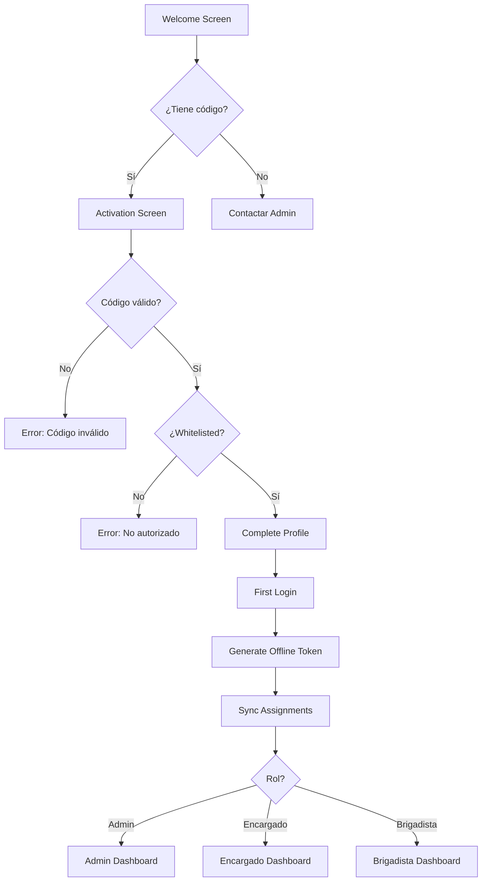
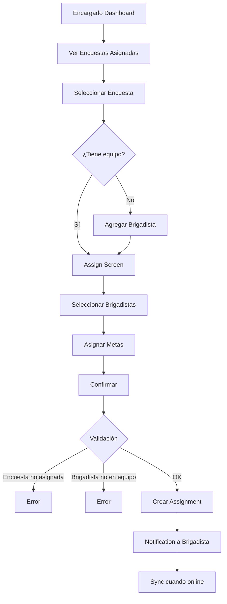
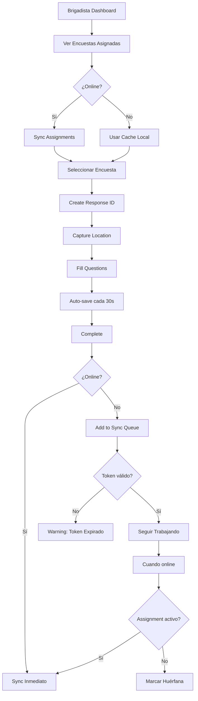

# Propuesta de Mejoras UI/UX - Brigada Digital

## Análisis y Rediseño de Pantallas Existentes

**Fecha:** 2026-02-10  
**Versión:** 1.0  
**Basado en:** Sistema de 42 reglas + Modelo de permisos por asignación

---

## Tabla de Contenidos

1. [Estado Actual de Pantallas](#estado-actual-de-pantallas)
2. [Problemas Identificados](#problemas-identificados)
3. [Arquitectura de Navegación Propuesta](#arquitectura-de-navegación-propuesta)
4. [Mejoras por Pantalla](#mejoras-por-pantalla)
5. [Nuevas Pantallas Necesarias](#nuevas-pantallas-necesarias)
6. [Flujos de Usuario por Rol](#flujos-de-usuario-por-rol)
7. [Componentes Reutilizables](#componentes-reutilizables)
8. [Plan de Implementación](#plan-de-implementación)

---

## Estado Actual de Pantallas

### Pantallas Existentes

```
app/
├── (auth)/
│   ├── welcome.tsx     ✅ Completa - Pantalla de bienvenida con features
│   ├── login.tsx       ✅ Completa - Login con email/password
│   └── _layout.tsx     ✅ Layout de autenticación
├── (tabs)/
│   ├── _layout.tsx     ⚠️  Genérica - Tabs por defecto (Home/Explore)
│   ├── index.tsx       ❌ Falta - No existe
│   └── explore.tsx     ❌ Falta - No existe
├── profile.tsx         ⚠️  Existe pero no integrado
└── components-demo.tsx ⚠️  Demo solamente
```

### Evaluación

**✅ Bien implementado:**

- `welcome.tsx`: Excelente diseño minimalista, animaciones suaves, features claras
- `login.tsx`: Validación inline, feedback inmediato, UX sólida

**⚠️ Necesita adaptación:**

- `(tabs)/_layout.tsx`: Tabs genéricas, no reflejan roles
- `profile.tsx`: No integrada con sistema de permisos

**❌ Falta implementar:**

- Dashboard por rol (Admin/Encargado/Brigadista)
- Gestión de asignaciones
- Gestión de equipos
- Llenado de encuestas
- Sincronización offline
- Revisión de respuestas

---

## Problemas Identificados

### 1. **No hay diferenciación por rol (CRÍTICO 🔴)**

**Problema:**

```tsx
// Todos los usuarios ven los mismos tabs
<Tabs.Screen name="index" options={{ title: 'Home' }} />
<Tabs.Screen name="explore" options={{ title: 'Explore' }} />
```

**Consecuencia:**

- Admin ve lo mismo que Brigadista
- No se respeta el modelo de permisos
- Violación de Reglas 6-11 (acceso por asignación)

**Solución:** Tabs dinámicos basados en `user.role`

---

### 2. **No hay flujo de activación con código (CRÍTICO 🔴)**

**Problema:**

- `login.tsx` solo tiene email/password
- No hay pantalla para ingresar código de activación
- Violación de Reglas 3-4 (activación requerida)

**Consecuencia:**

- Imposible onboarding de nuevos usuarios
- No se valida whitelist
- Sistema de invitaciones inútil

**Solución:** Pantalla de activación antes de login

---

### 3. **No hay indicador de estado de usuario (ALTO 🟡)**

**Problema:**

- No se muestra si usuario está: INVITED, PENDING, ACTIVE
- No se indica si está offline con token expirado

**Consecuencia:**

- Usuario no sabe su estado
- No se puede guiar en proceso de activación
- Confusión en flujo offline

**Solución:** Status bar persistente con estado

---

### 4. **No hay gestión de asignaciones (CRÍTICO 🔴)**

**Problema:**

- Encargado no puede ver sus encuestas asignadas
- No puede asignar encuestas a Brigadistas
- Brigadista no sabe qué encuestas puede llenar

**Consecuencia:**

- Sistema de asignaciones completo sin UI
- Reglas 7-11 no aplicables
- Flujo de trabajo roto

**Solución:** Pantallas de asignaciones por rol

---

### 5. **No hay indicador offline (CRÍTICO 🔴)**

**Problema:**

- No se indica si app está offline
- No se muestra cuándo expira token offline
- No se visualiza cola de sincronización

**Consecuencia:**

- Usuario no sabe si puede trabajar offline
- No hay warning de token expirado
- Datos en cola sin indicador

**Solución:** Persistent header con estado de red

---

### 6. **No hay manejo de errores de sync (ALTO 🟡)**

**Problema:**

- No se muestran respuestas con errores de sync
- No se indica si assignment fue revocado
- No hay pantalla de "orphaned responses"

**Consecuencia:**

- Trabajo perdido sin notificación
- Regla 24 (revocación) sin UX
- Frustración de usuario

**Solución:** Notification center + pantalla de errores

---

## Arquitectura de Navegación Propuesta

### Estructura de Carpetas Nueva

```
app/
├── (auth)/                     # Antes del login
│   ├── welcome.tsx             ✅ Mantener
│   ├── activation.tsx          🆕 Ingresar código
│   ├── login.tsx               ✅ Mantener (mejorar)
│   └── _layout.tsx             ✅ Mantener
│
├── (admin)/                    🆕 Solo Admin
│   ├── dashboard.tsx           # Resumen general
│   ├── surveys/
│   │   ├── index.tsx           # Lista de encuestas
│   │   ├── create.tsx          # Crear encuesta
│   │   └── [id]/
│   │       ├── edit.tsx        # Editar encuesta
│   │       └── assign.tsx      # Asignar a Encargados
│   ├── users/
│   │   ├── index.tsx           # Lista usuarios
│   │   ├── create.tsx          # Crear usuario (invite)
│   │   └── [id].tsx            # Detalle usuario
│   ├── responses/
│   │   ├── index.tsx           # Todas las respuestas
│   │   ├── flagged.tsx         # Respuestas flagged
│   │   └── orphaned.tsx        # Respuestas huérfanas
│   └── _layout.tsx             # Tabs de Admin
│
├── (encargado)/                🆕 Solo Encargado
│   ├── dashboard.tsx           # Mis encuestas asignadas
│   ├── surveys/
│   │   ├── index.tsx           # Lista mis encuestas
│   │   └── [id]/
│   │       ├── view.tsx        # Ver encuesta
│   │       └── assign.tsx      # Asignar a Brigadistas
│   ├── team/
│   │   ├── index.tsx           # Mi equipo
│   │   ├── add.tsx             # Agregar Brigadista
│   │   └── [id].tsx            # Detalle Brigadista
│   ├── responses/
│   │   ├── index.tsx           # Respuestas de mi equipo
│   │   └── [id].tsx            # Detalle respuesta
│   └── _layout.tsx             # Tabs de Encargado
│
├── (brigadista)/               🆕 Solo Brigadista
│   ├── dashboard.tsx           # Mis encuestas asignadas
│   ├── surveys/
│   │   ├── index.tsx           # Lista mis encuestas
│   │   └── [id]/
│   │       ├── fill.tsx        # Llenar encuesta
│   │       └── view.tsx        # Ver encuesta
│   ├── responses/
│   │   ├── index.tsx           # Mis respuestas
│   │   ├── pending-sync.tsx    # Pendientes de sync
│   │   └── [id].tsx            # Detalle respuesta
│   └── _layout.tsx             # Tabs de Brigadista
│
├── (shared)/                   🆕 Compartido por todos
│   ├── profile.tsx             # Perfil de usuario
│   ├── settings.tsx            # Configuración
│   ├── notifications.tsx       # Centro de notificaciones
│   └── help.tsx                # Ayuda
│
└── _layout.tsx                 # Root layout con header persistente
```

### Navegación Condicional por Rol

```tsx
// app/_layout.tsx
export default function RootLayout() {
  const { user, isLoading } = useAuth();

  if (isLoading) return <SplashScreen />;

  if (!user) {
    return <Stack screenName="(auth)" />; // Welcome → Activation → Login
  }

  // Redirigir según rol
  switch (user.role) {
    case "ADMIN":
      return <Redirect href="/(admin)/dashboard" />;
    case "ENCARGADO":
      return <Redirect href="/(encargado)/dashboard" />;
    case "BRIGADISTA":
      return <Redirect href="/(brigadista)/dashboard" />;
  }
}
```

---

## Mejoras por Pantalla

### 1. `(auth)/welcome.tsx` ✅ BIEN - Mejoras menores

**Estado actual:** Excelente diseño, buen onboarding

**Mejoras propuestas:**

```tsx
// ANTES: Solo botón "Iniciar sesión"
<Button onPress={() => router.push("/login")}>
  Iniciar sesión
</Button>

// DESPUÉS: Agregar botón de activación
<View style={styles.buttonContainer}>
  <Button
    variant="primary"
    onPress={() => router.push("/(auth)/activation")}
    icon="key-outline"
  >
    Tengo un código de activación
  </Button>

  <Button
    variant="outline"
    onPress={() => router.push("/(auth)/login")}
  >
    Ya tengo cuenta
  </Button>
</View>
```

**Razón:** Regla 4 - Activación con código es el flujo principal

---

### 2. `(auth)/login.tsx` ⚠️ MEJORAR - Agregar validaciones

**Estado actual:** Login básico funcional

**Mejoras propuestas:**

#### A. Agregar verificación de whitelist

```tsx
const handleLogin = async () => {
  setLoading(true);

  try {
    // 1. Validar credenciales
    const credentials = await AuthService.validateCredentials(email, password);

    // 2. Verificar whitelist (Regla 5)
    const isWhitelisted = await WhitelistService.checkWhitelist(email);

    if (!isWhitelisted) {
      setErrorMessage(
        "Tu cuenta no está autorizada. Contacta al administrador.",
      );
      setShowError(true);
      return;
    }

    // 3. Verificar estado de usuario
    if (credentials.user.state === "INVITED") {
      // Redirigir a activación
      router.push({
        pathname: "/(auth)/activation",
        params: { email },
      });
      return;
    }

    if (credentials.user.state === "DISABLED") {
      setErrorMessage("Tu cuenta ha sido deshabilitada.");
      setShowError(true);
      return;
    }

    // 4. Login exitoso
    await AuthService.login(credentials);

    // 5. Generar token offline (Regla 22)
    const offlineToken = await OfflineTokenService.generateToken(
      credentials.user.id,
    );

    // 6. Sincronizar asignaciones
    await syncUserAssignments(credentials.user.id, credentials.user.role);

    // 7. Redirigir según rol
    redirectByRole(credentials.user.role);
  } catch (error) {
    handleLoginError(error);
  } finally {
    setLoading(false);
  }
};
```

#### B. Agregar indicador de conectividad

```tsx
// Nuevo componente en header
<ConnectionStatus
  isOnline={isOnline}
  tokenExpiresAt={offlineToken?.expiresAt}
/>;

// Si está offline y token expirado
{
  !isOnline && tokenExpired && (
    <Alert
      type="warning"
      message="Token offline expirado. Necesitas conexión para continuar."
    />
  );
}
```

**Razón:** Reglas 5, 22, 23 - Validación de whitelist y manejo offline

---

### 3. `(tabs)/_layout.tsx` ❌ REEMPLAZAR - Tabs por rol

**Estado actual:** Tabs genéricas (Home/Explore)

**Propuesta:** 3 layouts diferentes

#### Admin Tabs

```tsx
// app/(admin)/_layout.tsx
export default function AdminTabLayout() {
  return (
    <Tabs
      screenOptions={{
        tabBarActiveTintColor: colors.primary,
        headerShown: false,
      }}
    >
      <Tabs.Screen
        name="dashboard"
        options={{
          title: "Dashboard",
          tabBarIcon: ({ color }) => (
            <Ionicons name="grid-outline" size={24} color={color} />
          ),
        }}
      />

      <Tabs.Screen
        name="surveys"
        options={{
          title: "Encuestas",
          tabBarIcon: ({ color }) => (
            <Ionicons name="document-text-outline" size={24} color={color} />
          ),
        }}
      />

      <Tabs.Screen
        name="users"
        options={{
          title: "Usuarios",
          tabBarIcon: ({ color }) => (
            <Ionicons name="people-outline" size={24} color={color} />
          ),
        }}
      />

      <Tabs.Screen
        name="responses"
        options={{
          title: "Respuestas",
          tabBarIcon: ({ color }) => (
            <Ionicons name="checkmark-done-outline" size={24} color={color} />
          ),
          tabBarBadge: orphanedCount > 0 ? orphanedCount : undefined,
        }}
      />
    </Tabs>
  );
}
```

#### Encargado Tabs

```tsx
// app/(encargado)/_layout.tsx
export default function EncargadoTabLayout() {
  const { assignedSurveysCount, teamSize } = useEncargadoStats();

  return (
    <Tabs>
      <Tabs.Screen
        name="dashboard"
        options={{
          title: "Inicio",
          tabBarIcon: ({ color }) => (
            <Ionicons name="home-outline" size={24} color={color} />
          ),
        }}
      />

      <Tabs.Screen
        name="surveys"
        options={{
          title: "Encuestas",
          tabBarIcon: ({ color }) => (
            <Ionicons name="clipboard-outline" size={24} color={color} />
          ),
          tabBarBadge: assignedSurveysCount,
        }}
      />

      <Tabs.Screen
        name="team"
        options={{
          title: "Equipo",
          tabBarIcon: ({ color }) => (
            <Ionicons name="people-outline" size={24} color={color} />
          ),
          tabBarBadge: teamSize,
        }}
      />

      <Tabs.Screen
        name="responses"
        options={{
          title: "Respuestas",
          tabBarIcon: ({ color }) => (
            <Ionicons name="list-outline" size={24} color={color} />
          ),
        }}
      />
    </Tabs>
  );
}
```

#### Brigadista Tabs

```tsx
// app/(brigadista)/_layout.tsx
export default function BrigadistaTabLayout() {
  const { pendingSyncCount } = useSyncStatus();

  return (
    <Tabs>
      <Tabs.Screen
        name="dashboard"
        options={{
          title: "Inicio",
          tabBarIcon: ({ color }) => (
            <Ionicons name="home-outline" size={24} color={color} />
          ),
        }}
      />

      <Tabs.Screen
        name="surveys"
        options={{
          title: "Encuestas",
          tabBarIcon: ({ color }) => (
            <Ionicons name="document-outline" size={24} color={color} />
          ),
        }}
      />

      <Tabs.Screen
        name="responses"
        options={{
          title: "Mis Respuestas",
          tabBarIcon: ({ color }) => (
            <Ionicons name="checkmark-circle-outline" size={24} color={color} />
          ),
          tabBarBadge: pendingSyncCount > 0 ? pendingSyncCount : undefined,
        }}
      />
    </Tabs>
  );
}
```

**Razón:** Reglas 6-11 - Acceso diferenciado por rol

---

## Nuevas Pantallas Necesarias

### 1. `(auth)/activation.tsx` 🔴 CRÍTICA

**Propósito:** Activar cuenta con código de 6 dígitos

**Features:**

- Input de 6 dígitos con auto-focus
- Validación en tiempo real
- Verificación de expiración
- Feedback de whitelist

```tsx
export default function ActivationScreen() {
  const [code, setCode] = useState(["", "", "", "", "", ""]);
  const [loading, setLoading] = useState(false);
  const [error, setError] = useState("");

  const handleActivation = async () => {
    const activationCode = code.join("");

    // Regla 22: Requiere internet
    if (!isOnline) {
      setError("Necesitas conexión a internet para activar tu cuenta");
      return;
    }

    try {
      // Validar código
      const invitation = await InvitationService.validateCode(activationCode);

      // Verificar expiración
      if (invitation.status === "EXPIRED") {
        setError("Este código ha expirado. Solicita uno nuevo.");
        return;
      }

      // Verificar whitelist (Regla 5)
      const isWhitelisted = await WhitelistService.checkWhitelist(
        invitation.email,
      );

      if (!isWhitelisted) {
        setError("Tu email no está autorizado. Contacta al administrador.");
        return;
      }

      // Activar cuenta
      router.push({
        pathname: "/(auth)/complete-profile",
        params: { invitationId: invitation.id },
      });
    } catch (error) {
      setError("Código inválido");
    }
  };

  return (
    <View style={styles.container}>
      <Text style={styles.title}>Código de Activación</Text>
      <Text style={styles.subtitle}>
        Ingresa el código de 6 dígitos que recibiste
      </Text>

      <CodeInput
        length={6}
        value={code}
        onChange={setCode}
        onComplete={handleActivation}
      />

      {error && <Alert type="error" message={error} />}

      <Button
        loading={loading}
        disabled={code.some((d) => d === "")}
        onPress={handleActivation}
      >
        Activar Cuenta
      </Button>
    </View>
  );
}
```

**Reglas aplicadas:** 3, 4, 5, 22

---

### 2. `(encargado)/dashboard.tsx` 🔴 CRÍTICA

**Propósito:** Vista principal del Encargado con métricas clave

```tsx
export default function EncargadoDashboard() {
  const { user } = useAuth();
  const { assignedSurveys, teamMembers, responsesCount, pendingAssignments } =
    useEncargadoStats(user.id);

  return (
    <ScrollView style={styles.container}>
      {/* Header con saludo */}
      <View style={styles.header}>
        <Text style={styles.greeting}>Hola, {user.fullName}</Text>
        <ConnectionStatus />
      </View>

      {/* Métricas principales */}
      <View style={styles.metricsGrid}>
        <MetricCard
          icon="clipboard-outline"
          title="Encuestas Asignadas"
          value={assignedSurveys.length}
          subtitle={`${assignedSurveys.filter((s) => s.status === "active").length} activas`}
          onPress={() => router.push("/(encargado)/surveys")}
        />

        <MetricCard
          icon="people-outline"
          title="Mi Equipo"
          value={teamMembers.length}
          subtitle={`${teamMembers.filter((m) => m.state === "ACTIVE").length} activos`}
          onPress={() => router.push("/(encargado)/team")}
        />

        <MetricCard
          icon="checkmark-done-outline"
          title="Respuestas"
          value={responsesCount}
          subtitle="Esta semana"
          onPress={() => router.push("/(encargado)/responses")}
        />

        <MetricCard
          icon="alert-circle-outline"
          title="Pendientes"
          value={pendingAssignments}
          subtitle="Por asignar"
          accent="warning"
        />
      </View>

      {/* Acciones rápidas */}
      <View style={styles.quickActions}>
        <Text style={styles.sectionTitle}>Acciones Rápidas</Text>

        <QuickActionButton
          icon="add-circle-outline"
          title="Asignar Encuesta"
          subtitle="A un brigadista"
          onPress={() => router.push("/(encargado)/surveys/assign")}
        />

        <QuickActionButton
          icon="person-add-outline"
          title="Agregar Brigadista"
          subtitle="A mi equipo"
          onPress={() => router.push("/(encargado)/team/add")}
        />
      </View>

      {/* Encuestas asignadas */}
      <View style={styles.surveysSection}>
        <Text style={styles.sectionTitle}>Mis Encuestas</Text>

        {assignedSurveys.map((survey) => (
          <SurveyCard
            key={survey.id}
            survey={survey}
            showAssignButton
            onAssign={() =>
              router.push(`/(encargado)/surveys/${survey.id}/assign`)
            }
          />
        ))}

        {assignedSurveys.length === 0 && (
          <EmptyState
            icon="clipboard-outline"
            message="No tienes encuestas asignadas"
            subtitle="Espera a que un administrador te asigne encuestas"
          />
        )}
      </View>
    </ScrollView>
  );
}
```

**Reglas aplicadas:** 8, 9, 11 - Solo ve encuestas asignadas

---

### 3. `(encargado)/surveys/[id]/assign.tsx` 🔴 CRÍTICA

**Propósito:** Asignar encuesta a brigadistas del equipo

```tsx
export default function AssignSurveyToTeam() {
  const { id: surveyId } = useLocalSearchParams();
  const { user } = useAuth();

  const { data: survey } = useSurvey(surveyId);
  const { data: teamMembers } = useTeamMembers(user.id);
  const { data: existingAssignments } = useBrigadistaAssignments(
    surveyId,
    user.id,
  );

  const [selectedBrigadistas, setSelectedBrigadistas] = useState<string[]>([]);
  const [targetCounts, setTargetCounts] = useState<Record<string, number>>({});

  const handleAssign = async () => {
    // Regla 9: Validar que Encargado tiene esta encuesta asignada
    const hasAccess = await PermissionService.canAccessSurvey(
      user.id,
      "ENCARGADO",
      surveyId,
    );

    if (!hasAccess) {
      showError("No tienes acceso a esta encuesta");
      return;
    }

    // Asignar a cada brigadista seleccionado
    for (const brigadistaId of selectedBrigadistas) {
      // Regla 9: Validar que brigadista está en el equipo
      const isInTeam = await TeamService.isInTeam(user.id, brigadistaId);

      if (!isInTeam) {
        showError(`El brigadista no está en tu equipo`);
        continue;
      }

      await AssignmentService.assignSurveyToBrigadista({
        surveySchemaId: surveyId,
        brigadistaId,
        encargadoId: user.id,
        targetCount: targetCounts[brigadistaId] || null,
        notes: `Asignado desde dashboard`,
      });
    }

    showSuccess("Encuesta asignada exitosamente");
    router.back();
  };

  return (
    <View style={styles.container}>
      <Text style={styles.title}>Asignar: {survey.name}</Text>

      <View style={styles.teamList}>
        {teamMembers.map((member) => {
          const isAssigned = existingAssignments.some(
            (a) => a.brigadistaId === member.id && a.isActive,
          );

          return (
            <TeamMemberCheckbox
              key={member.id}
              member={member}
              isSelected={selectedBrigadistas.includes(member.id)}
              isAlreadyAssigned={isAssigned}
              onToggle={(selected) => {
                if (selected) {
                  setSelectedBrigadistas((prev) => [...prev, member.id]);
                } else {
                  setSelectedBrigadistas((prev) =>
                    prev.filter((id) => id !== member.id),
                  );
                }
              }}
              onTargetCountChange={(count) => {
                setTargetCounts((prev) => ({ ...prev, [member.id]: count }));
              }}
            />
          );
        })}
      </View>

      {teamMembers.length === 0 && (
        <EmptyState
          icon="people-outline"
          message="No tienes brigadistas en tu equipo"
          action={{
            label: "Agregar Brigadista",
            onPress: () => router.push("/(encargado)/team/add"),
          }}
        />
      )}

      <Button
        disabled={selectedBrigadistas.length === 0}
        onPress={handleAssign}
      >
        Asignar a {selectedBrigadistas.length} brigadista(s)
      </Button>
    </View>
  );
}
```

**Reglas aplicadas:** 9, 10, 11 - Solo asigna a SU equipo y SUS encuestas

---

### 4. `(brigadista)/surveys/[id]/fill.tsx` 🔴 CRÍTICA

**Propósito:** Llenar encuesta con validación y auto-guardado

```tsx
export default function FillSurveyScreen() {
  const { id: surveyId } = useLocalSearchParams();
  const { user } = useAuth();

  const { data: survey } = useSurvey(surveyId);
  const [responseId, setResponseId] = useState<string | null>(null);
  const [answers, setAnswers] = useState<Record<string, any>>({});
  const [location, setLocation] = useState<LocationData | null>(null);

  // Auto-save cada 30 segundos
  useAutoSave(responseId, answers, 30000);

  useEffect(() => {
    // Regla 10: Validar acceso
    validateAccess();

    // Crear response ID
    initializeResponse();

    // Capturar ubicación (Regla 33)
    captureLocation();
  }, []);

  const validateAccess = async () => {
    const hasAccess = await PermissionService.canAccessSurvey(
      user.id,
      "BRIGADISTA",
      surveyId,
    );

    if (!hasAccess) {
      showError("No tienes permiso para llenar esta encuesta");
      router.back();
    }
  };

  const initializeResponse = async () => {
    const newResponseId = generateUUID();

    // Obtener Encargado responsable
    const assignment = await getBrigadistaAssignment(user.id, surveyId);

    await ResponseService.createResponse({
      id: newResponseId,
      schemaId: surveyId,
      schemaVersion: survey.version,
      collectedBy: user.id,
      responsibleEncargadoId: assignment.encargadoId, // Regla 12
      status: "in_progress",
    });

    setResponseId(newResponseId);
  };

  const captureLocation = async () => {
    // Regla 33-35: Capturar ubicación como evidencia
    const loc = await LocationService.captureLocation();

    if (loc.state === "DENIED") {
      showWarning(
        "Ubicación deshabilitada. La encuesta se marcará sin ubicación verificada.",
      );
    }

    if (loc.isMockLocation) {
      showWarning("Ubicación simulada detectada");
    }

    setLocation(loc);
  };

  const handleAnswerChange = async (questionId: string, value: any) => {
    setAnswers((prev) => ({ ...prev, [questionId]: value }));

    // Guardar respuesta inmediatamente
    await QuestionAnswerService.saveAnswer({
      responseId,
      questionId,
      value,
      questionType: getQuestionType(questionId),
      answeredAt: new Date().toISOString(),
    });
  };

  const handleSubmit = async () => {
    // Validar respuestas requeridas
    const validation = validateRequiredQuestions(survey, answers);

    if (!validation.isValid) {
      showError(`Faltan ${validation.missingCount} preguntas requeridas`);
      return;
    }

    // Marcar como completada
    await ResponseService.completeResponse({
      id: responseId,
      completedAt: new Date().toISOString(),
      duration: calculateDuration(),
      latitude: location?.latitude,
      longitude: location?.longitude,
      accuracy: location?.accuracy,
      locationQuality: location?.state === "ACQUIRED_HIGH" ? "high" : "low",
    });

    // Agregar a cola de sincronización
    if (!isOnline) {
      await SyncQueue.add({
        operation: "create_response",
        entityType: "survey_response",
        entityId: responseId,
        priority: 1,
      });
    }

    showSuccess("Encuesta completada");
    router.push("/(brigadista)/responses");
  };

  return (
    <View style={styles.container}>
      {/* Progress bar */}
      <ProgressBar
        current={Object.keys(answers).length}
        total={getTotalQuestions(survey)}
      />

      {/* Location indicator */}
      <LocationIndicator location={location} />

      {/* Offline indicator */}
      {!isOnline && (
        <Alert
          type="info"
          message="Trabajando offline. Se sincronizará automáticamente."
        />
      )}

      {/* Survey questions */}
      <ScrollView>
        {survey.sections.map((section) => (
          <Section key={section.id}>
            <Text style={styles.sectionTitle}>{section.title}</Text>

            {section.questions.map((question) => (
              <QuestionRenderer
                key={question.id}
                question={question}
                value={answers[question.id]}
                onChange={(value) => handleAnswerChange(question.id, value)}
              />
            ))}
          </Section>
        ))}
      </ScrollView>

      <Button onPress={handleSubmit}>Completar Encuesta</Button>
    </View>
  );
}
```

**Reglas aplicadas:** 10, 12, 14, 21, 33-35

---

### 5. `(admin)/responses/orphaned.tsx` 🟡 IMPORTANTE

**Propósito:** Revisar respuestas huérfanas por revocación

```tsx
export default function OrphanedResponsesScreen() {
  const { data: orphanedResponses } = useOrphanedResponses();

  const handleReview = async (
    responseId: string,
    action: "accept" | "reject",
  ) => {
    if (action === "accept") {
      // Asignar a nuevo Encargado
      router.push({
        pathname: "/(admin)/responses/[id]/reassign",
        params: { id: responseId },
      });
    } else {
      // Rechazar (soft delete)
      await ResponseService.rejectResponse(responseId);
    }
  };

  return (
    <View>
      <Text style={styles.title}>Respuestas Huérfanas</Text>
      <Text style={styles.subtitle}>
        {orphanedResponses.length} respuestas sin Encargado responsable
      </Text>

      {orphanedResponses.map((response) => (
        <OrphanedResponseCard
          key={response.id}
          response={response}
          reason={response.syncError}
          onAccept={() => handleReview(response.id, "accept")}
          onReject={() => handleReview(response.id, "reject")}
        />
      ))}
    </View>
  );
}
```

**Reglas aplicadas:** 12, 13, 24 - Manejo de respuestas huérfanas

---

## Flujos de Usuario por Rol

### Flujo 1: Onboarding de Nuevo Usuario



**Pantallas involucradas:**

1. `(auth)/welcome.tsx`
2. `(auth)/activation.tsx` 🆕
3. `(auth)/complete-profile.tsx` 🆕
4. `(auth)/login.tsx`
5. Dashboard según rol

---

### Flujo 2: Encargado Asigna Encuesta



**Pantallas involucradas:**

1. `(encargado)/dashboard.tsx` 🆕
2. `(encargado)/surveys/index.tsx` 🆕
3. `(encargado)/surveys/[id]/assign.tsx` 🆕
4. `(encargado)/team/add.tsx` 🆕

---

### Flujo 3: Brigadista Llena Encuesta Offline



**Pantallas involucradas:**

1. `(brigadista)/dashboard.tsx` 🆕
2. `(brigadista)/surveys/index.tsx` 🆕
3. `(brigadista)/surveys/[id]/fill.tsx` 🆕
4. `(brigadista)/responses/pending-sync.tsx` 🆕

---

## Componentes Reutilizables

### 1. `ConnectionStatus` - Header persistente

```tsx
export function ConnectionStatus() {
  const { isOnline } = useNetworkStatus();
  const { offlineToken } = useAuth();

  const tokenExpiresSoon =
    offlineToken &&
    new Date(offlineToken.expiresAt).getTime() - Date.now() <
      24 * 60 * 60 * 1000;

  return (
    <View style={styles.status}>
      {/* Indicador de red */}
      <View style={[styles.dot, isOnline ? styles.online : styles.offline]} />

      <Text style={styles.text}>{isOnline ? "En línea" : "Sin conexión"}</Text>

      {/* Warning si token expira pronto */}
      {!isOnline && tokenExpiresSoon && (
        <Ionicons name="warning-outline" size={16} color={colors.warning} />
      )}
    </View>
  );
}
```

---

### 2. `SyncQueueIndicator` - Cola de sincronización

```tsx
export function SyncQueueIndicator() {
  const { pendingCount, processing } = useSyncQueue();

  if (pendingCount === 0) return null;

  return (
    <TouchableOpacity
      style={styles.indicator}
      onPress={() => router.push("/(shared)/sync-status")}
    >
      <Ionicons
        name={processing ? "sync" : "cloud-upload-outline"}
        size={20}
        color={colors.primary}
      />
      <Text style={styles.count}>{pendingCount}</Text>
    </TouchableOpacity>
  );
}
```

---

### 3. `PermissionGate` - Control de acceso

```tsx
export function PermissionGate({
  children,
  requiredPermission,
  fallback,
}: PermissionGateProps) {
  const { user } = useAuth();
  const hasPermission = usePermission(requiredPermission);

  if (!hasPermission) {
    return fallback || <NoPermissionView />;
  }

  return <>{children}</>;
}

// Uso
<PermissionGate requiredPermission="assign_survey">
  <Button onPress={handleAssign}>Asignar</Button>
</PermissionGate>;
```

---

### 4. `AssignmentBadge` - Indicador de asignación

```tsx
export function AssignmentBadge({ userId, surveyId }: AssignmentBadgeProps) {
  const { isAssigned, assignment } = useAssignment(userId, surveyId);

  if (!isAssigned) return null;

  return (
    <View style={styles.badge}>
      <Ionicons name="checkmark-circle" size={16} color={colors.success} />
      <Text style={styles.text}>Asignada</Text>

      {assignment.targetCount && (
        <Text style={styles.target}>Meta: {assignment.targetCount}</Text>
      )}
    </View>
  );
}
```

---

## Plan de Implementación

### Fase 1: Fundamentos (Semana 1-2) 🔴 CRÍTICA

**Prioridad:** Bloquea todo lo demás

- [ ] **1.1** Crear `ConnectionStatus` component
- [ ] **1.2** Crear `PermissionGate` component
- [ ] **1.3** Crear hook `usePermissions`
- [ ] **1.4** Crear hook `useAssignments`
- [ ] **1.5** Actualizar `_layout.tsx` con header persistente
- [ ] **1.6** Crear navegación condicional por rol

**Entregables:**

- Sistema de permisos funcionando
- Indicadores de estado visibles
- Navegación por rol implementada

---

### Fase 2: Autenticación (Semana 2-3) 🔴 CRÍTICA

**Prioridad:** Onboarding bloqueado

- [ ] **2.1** Crear `(auth)/activation.tsx`
- [ ] **2.2** Crear `(auth)/complete-profile.tsx`
- [ ] **2.3** Mejorar `(auth)/login.tsx` con validaciones
- [ ] **2.4** Actualizar `(auth)/welcome.tsx` con botón activación
- [ ] **2.5** Implementar `WhitelistService`
- [ ] **2.6** Implementar `InvitationService`
- [ ] **2.7** Implementar `OfflineTokenService`

**Entregables:**

- Flujo completo de activación
- Validación de whitelist
- Tokens offline generados

---

### Fase 3: Dashboards (Semana 3-4) 🟡 ALTA

**Prioridad:** Navegación principal

- [ ] **3.1** Crear `(admin)/dashboard.tsx`
- [ ] **3.2** Crear `(admin)/_layout.tsx` con tabs
- [ ] **3.3** Crear `(encargado)/dashboard.tsx`
- [ ] **3.4** Crear `(encargado)/_layout.tsx` con tabs
- [ ] **3.5** Crear `(brigadista)/dashboard.tsx`
- [ ] **3.6** Crear `(brigadista)/_layout.tsx` con tabs
- [ ] **3.7** Crear componentes `MetricCard`, `QuickActionButton`

**Entregables:**

- 3 dashboards funcionales por rol
- Métricas en tiempo real
- Acciones rápidas

---

### Fase 4: Asignaciones (Semana 4-5) 🔴 CRÍTICA

**Prioridad:** Corazón del sistema

- [ ] **4.1** Crear `(encargado)/surveys/index.tsx`
- [ ] **4.2** Crear `(encargado)/surveys/[id]/assign.tsx`
- [ ] **4.3** Crear `(encargado)/team/index.tsx`
- [ ] **4.4** Crear `(encargado)/team/add.tsx`
- [ ] **4.5** Implementar `AssignmentService`
- [ ] **4.6** Implementar `TeamService`
- [ ] **4.7** Crear componentes de asignación

**Entregables:**

- Encargado puede asignar encuestas
- Gestión de equipo completa
- Validaciones de permisos

---

### Fase 5: Llenado de Encuestas (Semana 5-6) 🔴 CRÍTICA

**Prioridad:** Funcionalidad core

- [ ] **5.1** Crear `(brigadista)/surveys/index.tsx`
- [ ] **5.2** Crear `(brigadista)/surveys/[id]/fill.tsx`
- [ ] **5.3** Crear `QuestionRenderer` component
- [ ] **5.4** Implementar auto-guardado
- [ ] **5.5** Implementar captura de ubicación
- [ ] **5.6** Implementar captura de INE
- [ ] **5.7** Implementar firma digital
- [ ] **5.8** Implementar validaciones

**Entregables:**

- Brigadista puede llenar encuestas
- Auto-guardado funcional
- Captura de evidencias

---

### Fase 6: Sincronización (Semana 6-7) 🟡 ALTA

**Prioridad:** Offline-first

- [ ] **6.1** Crear `SyncQueueIndicator` component
- [ ] **6.2** Crear `(shared)/sync-status.tsx`
- [ ] **6.3** Implementar `SyncService`
- [ ] **6.4** Implementar cola de sincronización
- [ ] **6.5** Implementar detección de conflictos
- [ ] **6.6** Crear pantalla de errores de sync

**Entregables:**

- Sincronización automática
- Cola visible
- Manejo de errores

---

### Fase 7: Respuestas y Revisión (Semana 7-8) 🟡 ALTA

**Prioridad:** Supervisión

- [ ] **7.1** Crear `(encargado)/responses/index.tsx`
- [ ] **7.2** Crear `(brigadista)/responses/index.tsx`
- [ ] **7.3** Crear `(admin)/responses/flagged.tsx`
- [ ] **7.4** Crear `(admin)/responses/orphaned.tsx`
- [ ] **7.5** Implementar revisión de respuestas
- [ ] **7.6** Implementar sistema de revisiones (versioning)

**Entregables:**

- Ver respuestas por rol
- Revisar respuestas huérfanas
- Sistema de versiones

---

### Fase 8: Admin Features (Semana 8-9) 🟢 MEDIA

**Prioridad:** Gestión avanzada

- [ ] **8.1** Crear `(admin)/surveys/index.tsx`
- [ ] **8.2** Crear `(admin)/surveys/create.tsx`
- [ ] **8.3** Crear `(admin)/users/index.tsx`
- [ ] **8.4** Crear `(admin)/users/create.tsx`
- [ ] **8.5** Implementar gestión de encuestas
- [ ] **8.6** Implementar gestión de usuarios

**Entregables:**

- Admin crea encuestas
- Admin crea usuarios
- Admin gestiona sistema

---

## Resumen de Mejoras

### ✅ Pantallas Existentes Mejoradas

| Pantalla             | Estado        | Mejoras                                               |
| -------------------- | ------------- | ----------------------------------------------------- |
| `welcome.tsx`        | ✅ Mantener   | Agregar botón "Tengo código"                          |
| `login.tsx`          | ⚠️ Mejorar    | Validación whitelist + token offline + estado usuario |
| `(tabs)/_layout.tsx` | ❌ Reemplazar | 3 layouts diferentes por rol                          |

### 🆕 Pantallas Nuevas Requeridas (26 pantallas)

**Auth (2):**

- `activation.tsx` - Código de 6 dígitos
- `complete-profile.tsx` - Completar datos

**Admin (12):**

- Dashboard, surveys (CRUD), users (CRUD), responses (list/flagged/orphaned)

**Encargado (10):**

- Dashboard, surveys (list/assign), team (list/add), responses (list/detail)

**Brigadista (8):**

- Dashboard, surveys (list/fill), responses (list/detail/pending-sync)

**Shared (4):**

- Profile, settings, notifications, help

### 🔧 Componentes Reutilizables (15+)

- `ConnectionStatus` - Estado de red
- `SyncQueueIndicator` - Cola de sync
- `PermissionGate` - Control de acceso
- `AssignmentBadge` - Indicador de asignación
- `MetricCard` - Métricas en dashboard
- `QuickActionButton` - Acciones rápidas
- `SurveyCard` - Tarjeta de encuesta
- `TeamMemberCard` - Tarjeta de brigadista
- `ResponseCard` - Tarjeta de respuesta
- `LocationIndicator` - Estado de ubicación
- `ProgressBar` - Progreso de encuesta
- `QuestionRenderer` - Renderizador de preguntas
- `EmptyState` - Estados vacíos
- `Alert` - Alertas y notificaciones
- `CodeInput` - Input de 6 dígitos

### 📊 Impacto por Regla

| Reglas                 | Pantallas Afectadas        | Componentes                     |
| ---------------------- | -------------------------- | ------------------------------- |
| 1-5 (Auth)             | activation, login, welcome | WhitelistCheck, ActivationCode  |
| 6-11 (Assignments)     | 15+ pantallas              | PermissionGate, AssignmentBadge |
| 12-16 (Responsibility) | responses/orphaned         | RevisionHistory                 |
| 17-20 (Versioning)     | fill survey                | VersionIndicator                |
| 21-24 (Offline)        | ALL                        | ConnectionStatus, SyncQueue     |
| 25-29 (OCR)            | fill survey                | INECapture, OCRStatus           |
| 30-32 (Fraud)          | admin/responses            | FraudFlags                      |
| 33-35 (Location)       | fill survey                | LocationCapture                 |
| 36-38 (Consent)        | fill survey                | ConsentDialog                   |
| 39-41 (UX)             | ALL                        | AutoSave, ErrorRecovery         |

---

## Próximos Pasos Inmediatos

### Esta Semana (Prioridad 1) 🔴

1. **Crear estructura de carpetas** (1 hora)

   ```bash
   mkdir -p app/(admin) app/(encargado) app/(brigadista) app/(shared)
   ```

2. **Implementar navegación por rol** (4 horas)
   - Actualizar `app/_layout.tsx`
   - Crear 3 `_layout.tsx` por rol

3. **Crear `ConnectionStatus` component** (2 horas)
   - Header persistente
   - Indicador online/offline
   - Warning token expirado

4. **Crear pantalla de activación** (6 horas)
   - `(auth)/activation.tsx`
   - Input de 6 dígitos
   - Validación de código

### Próxima Semana (Prioridad 2) 🟡

5. **Crear 3 dashboards básicos** (12 horas)
   - Admin dashboard
   - Encargado dashboard
   - Brigadista dashboard

6. **Implementar AssignmentService** (8 horas)
   - CRUD de asignaciones
   - Validaciones de permisos

7. **Crear pantalla de asignación** (8 horas)
   - `(encargado)/surveys/[id]/assign.tsx`

**Estimación Total Fase 1-2:** ~40 horas (2 semanas)

---

**Documento creado:** 2026-02-10  
**Última actualización:** 2026-02-10  
**Autor:** Sistema de Análisis Brigada Digital
